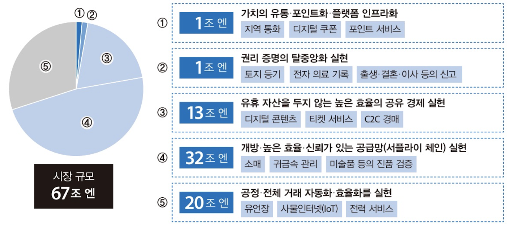
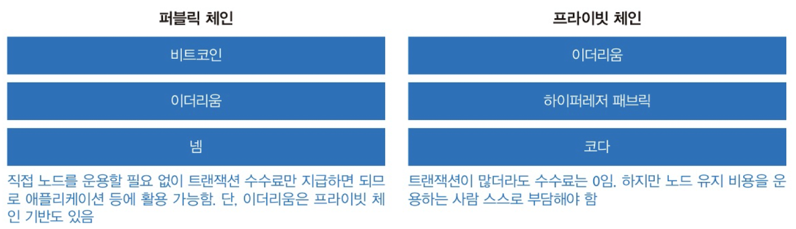

# 블록체인 이해하기

블록체인에는 이해하기 어려운 다양한 기능이 있다. 우선 블록체인의 목적과 구조를 살펴보자.

## 01 블록체인이 가져다 준 충격

*"왜 블록체인을 주목해야 할 기술로 여기는 것일까?"*

### 블록체인 사용처

*블록체인 관련 시장 규모 (출처: 경제산업성)*

블록체인은 처음에 핀테크를 지원하는 핵심 기술로 송금, 결제 증권 거래 등의 분야에 응용될 것으로 기대했다. 하지만 요즘은 광고, 유통 분야 효율화, 지적 재산권 관리, 유휴 시설 공유, 각종 법적 신고 등기처리에 사용할 가능성을 보이고 있다.

### 한 문장으로 설명하는 블록체인

> 올바른 것만 기록할 수 있고, 변경할 수 없고, 지울 수 없고, 변조할 수 없고, 고장을 복구할 수 있고, 중단되지 않고, 모두가 합의한 내용만 유효하다고 인식하는 네트워크 공유형 데이터베이스

### 블록체인에 무엇을 기록하고 싶은가?

블록체인이 기능이 강화된 네트워크 공유형 데이터베이스라면 무엇을 기록할 수 있는가?

- 화폐, 증권, 채권, 증거, 인증서, 포인트, 스탬프, 쿠폰, 권리, 계약 등

## 02 블록체인의 정의

### 블록체인이란?

아직 전문가 집단에서도 정의되지 않았지만, 위키에서는 다음과 같의 정의하고 있다.

1. 대상 데이터를 '블록'이라고 하는 소규모 데이터들이 P2P 방식을 기반으로 생성된 체인 형태의 연결고리 기반 분산 데이터 저장 환경에 저장하여 누구라도 임의로 수정할 수 없고 누구나 변경의 결과를 열람할 수 있는 분산 컴퓨팅 기술 기반의 원장 관리 기술이다.
2. 블록체인은 대규모의 노드들 사이에서 각 노드에 분산 저장된 장부의 데이터를 항상 있도록 하는 합의 수렴 알고리즘으로 볼 수 있다.

### 합의 수렴 알고리즘

블록체인은 잘못된 사실을 기록할 수 있는 참가자와 고장이 나 제대로 동작하지 않는 참가자가 있을 수 있따. 이러한 참가자를 가지고 완벽한 합의를 끌어낼 수 있을까? 블록체인은 이러한 상황에서도 실제 합의를 끌어내는 구조를 가지고 있다. '분산 저장된 장부의 데이터를 항상 있게 하는 합의'는 시간이 지날수록 당시의 합의가 뒤집힐 가능성이 있기 때문이다.

2번 정의를 다시 정리해보면 다음과 같다.

**블록체인의 정의**

1. 잘못된 사실을 기록할 수 있는 참여자가 있을지도 모름
2. 어떤 이유로 고장이 나 제대로 동작하지 않는 참여자가 있을지도 모름
3. 1, 2 같은 참여자가 있는 환경에서도 합의할 수 있는 구조가 있음
4. 3의 합의는 시간이 지날수록 뒤집힐 확률이 0에 수렴함

**넓은 범위의 블록체인 = 분산 원장 기술**

1. 암호화 기술로 변조 검증이 쉬운 데이터 구조가 있음
2. 네트워크의 여러 컴퓨터에 분산해 데이터를 저장함
3. 2의 특징을 강화해 중단 없는 고가용성 상태를 구현함
4. 2에서 분산해 저장한 데이터가 같음을 보장하는 구조가 있음

### 데이터베이스와 차이

블록체인은 기본적으로 정보 기록 매체라는 의미에서 데이터베이스의 한 종류이다. 그리너 기존 데이터베이스와 결정적으로 다른점은 다음과 같은 기능을 **모두** 갖췄다는 것이다.

1. 데이터는 여러 참여자가 확인한 규칙에 따른 서식만 기록
2. 참여자 전원이 합의한 데이터만 유효하다는 약속에 따라 운용
3. 변조하기 어려운 데이터 구조(해시 체인 구조)
4. 수정하려는 동작을 즉시 감지하고 수정한 데이터는 손상된 것으로 인식
5. 손상된 데이터는 다른 참여자의 정상 데이터를 통해 복구
6. 한번 기록된 데이터는 누구도 수정 및 삭제가 불가능
7. 누구도 시스템 전체를 중단시킬 수 없음

## 03 블록체인의 기초 1

화폐를 교환하는 사례를 통해 블록체인이 어떤 역할을 하는지 알아보도록하자.

### 가치 유통 구조

*"블록체인은 컴퓨터와 네트워크로 가치를 유통하는 구조"*

여기서 말하는 가치란 무엇일까? 화폐 뿐 아니라 증권, 채권, 포인트 처럼 특정 장소에서만 통하는 가치도 포함된다.

화폐라는 가치를 유통한다고 생각해보자. 블록체인 안의 지폐와 현실 속 화폐에는 결정적 차이가 있다. 현실화폐는 국가가 발행하지만, 블록체인 안의 화폐는 국가가 발행하지 않는다는 점이다.

### 화폐로 인정받는데 필요한 조건

1. 화폐를 다루는 시스템이 고장나거나 데이터가 사라지지 않아야한다.
2. 화폐 거래를 조작할 수 없어야한다.

### 절대로 고장나지 않는 시스템?

블록체인은 절대로 고장나지 않는 시스템은 아니다. '조금 고장나도 괜찮은 시스템'이다. 다중화를 통해 데이터를 여러 노드에 복사해놓으면 특정 노드가 몇개 고장나도 문제 없는 시스템이다.

### 중앙이 없는 네트워크

블록체인은 자율 분산 시스템이다. 자율 분산 시스템의 특징은 다음과 같다.

1. 리더 역할을 하는 노드가 없다.
2. 노드 각각이 마음대로 동작한다.
3. 리더가 없으므로 같은 데이터를 여러번 복사할 수 있지만, 데이터가 바뀌는 것이 아니므로 상관없다.

## 04 블록체인의 기초 2

화폐를 교환하는 구조인 지갑 주소를 간단하게 살펴보도록 한다.

### 블록체인에서 화폐 교환 방법

공개키 암호키 쌍에 대응하는 지갑 주소라는 것을 통해서 화폐를 교환한다. 은행 통장과 비슷해보이나, 보안 카드나 OTP와 같은 열쇠 역할도 겸한다는 점이 다르다.

블록체인은 거래 기록 정보를 네트워크 참여자에 복사하고 공유한다. 하지만 화폐 사용까지 자유로운 것은 아니다. 송금하려는 지갑 주소에 대응하는 비밀키가 있는 사용자만 화폐를 사용할 수 있다. 

### 서비스에 회원가입하지 않는 지갑 주소

지갑 주소는 은행 통장과 다르게 특정 회사나 벤더 서비스에 개인 정보를 넣어 만들지 않는다. 사용하는 컴퓨터에 암호화폐에서 정한 형식의 비밀키와 공개키 쌍을 만들어 지갑 주소를 생성할 수도 있다. 이는 은행 통장보다 익명성이 더 보장는 특징을 가진다.

### 블록체인이 기록하는 것은?

예금 통장은 현재 잔액의 숫자를 기록하지만 지갑 주소는 지갑 주소 A에서 지갑 주소 B에 얼마를 출금,송금했다만 남는다. 블록체인에서는 지갑 주소 사이의 화폐 교환을 트랜잭션이라고 한다. 우리가 보는 코인들의 잔액은 이런 트랜잭션을 모두 합한 결과이다. 

### 블록체인의 특징

1. 자율 분산 시스템
   - 블록체인은 자율 분산 시스템으로 많은 노드가 데이터를 배턴 전달하듯 복사한다. 모든 노드의 동작도 같으므로 일부 노드가 고장나도 전체 시스템 동작에는 영향이 없다.
2. 리더가 없는 구조
   - 리더가 없으므로 특정 노드가 고장나면 중단되는 약점이 없다.
3. 지갑 주소
   - 블록체인은 공개 키 암호의 공개키, 비밀키로 지갑 주소에 대응한다.
4. 트랜잭션
   - 블록체인은 현재 잔액을 알 수 없다. 트랜잭션만을 알 뿐이다.

## 05 블록체인의 종류

### 두 종류의 블록체인

블록체인은 크게 퍼블릭과 프라이빗으로 나눌 수 있다. 참여자 수를 제한할 수 있느냐에 따라 이 둘을 구분한다. 참여자의 수를 제한한다는 것은 네트워크에 참여한 노드 개수를 파악할 수 있냐고도 생각할 수 있다. 퍼블릭 체인은 누구든지 원하는 만큼 네트워크에 노드를 참여 시키는 상태이다. 프라이빗 체인은 네트워크 참여자를 제한(참여하는데 승인이 필요)하는 상태로 운용한다. 즉 모든 노드가 문제가 없다면 총 몇대가 참여 중인지 알 수 있다.

퍼블릭, 프라이빗 체인은 트랜잭션을 기록할 때 사용하는 알고리즘인 합의 알고리즘에 큰 차이가 있다. 이는 추후 다루도록 한다.

### 퍼블릭 체인

비트코인이 대표적인 퍼블릭 체인이다. 아무나 참여할 수 있으므로 악의적인 참여자가 있을 수 있지만, 과반수가 넘는 참여자가 선의로 행동한다면 동작에 큰 문제는 안 생긴다. 퍼블릭 체인은 대부분 정상적으로 노드를 운용하는 사람(마이너)에게 경제적 이익이 돌아가는 구조이다..

### 프라이빗 체인

노드 수를 항상 파악한다는 전제로 운용되는 프라이빗 체인은 보통 퍼블릭 쳉니에 비해 노드수가 적으므로 전체 동작도 빠르다고 알려져 있다. 프라이빗 체인은 중앙화 개념이 포함되므로 굳이 블록체인을 사용해야하냐라는 비판도 있다.

*퍼블릭 체인과 프라이빗 체인의 종류와 특징*

## 06 블록체인의 특징

블록체인은 참여자가 승인한 정보만 기록한다. 기록한 데이터는 누구도 수정, 변조 삭제할 수 없어 상거래 기록 용도로는 적합하지만, 개인 정보 등을 기록하는 용도로는 적합하지 않다.

### 장점

1. 관리자가 없어도 동작하는 시스템
   - 서비스 제공자나 시스템 관리자조차 데이터 변조와 변경이 불가능하다.
2. 서비스 제공자의 신뢰도가 낮아도 되는 서비스
   - 블록체인은 수학 이론과 정보 기술을 결합해 서비스 제공자가 누구든 상관 없이 기록된 데이터가 정확하다는 것을 보장한다. 즉 서로 신뢰하지 않는 사람 사이의 거래에도 문제가 발생하지 않는다.

### 단점

1. 기록된 데이터를 삭제할 수 없다.
   - 많은 노드가 같은 데이터를 복사하고 공유하기 때문에 데이터를 변조할 수 없다. 개인정보 또한 변조가 불가능 하기 때문에 개인정보 기록이 필요하다면 서브 시스템이 필요하다.
2. 접근 제어가 불가능하다.
   - 블록체인의 데이터는 누구나 볼 수 있기 때문에 데이터를 숨기기 위해서는 서브 시스템의 도움이 필요하다.

