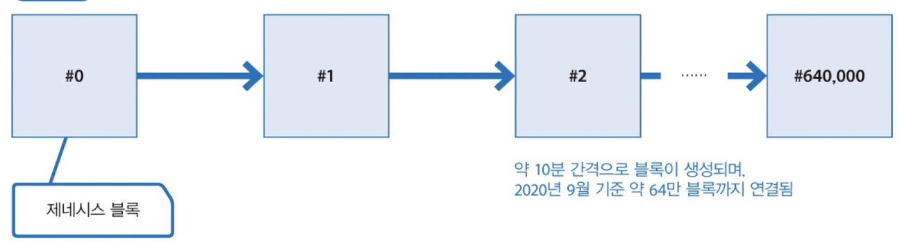
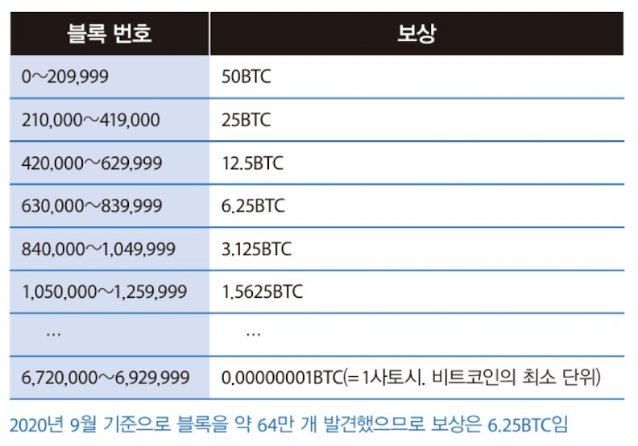
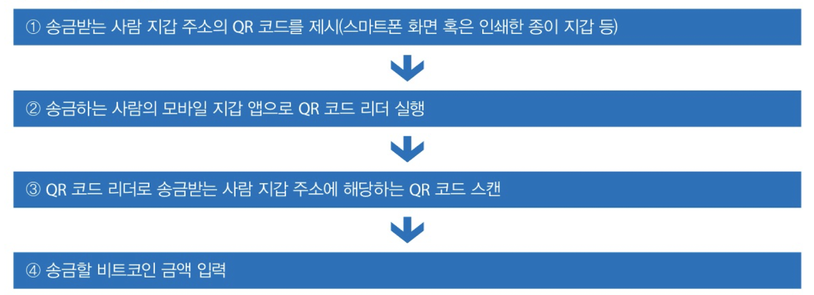
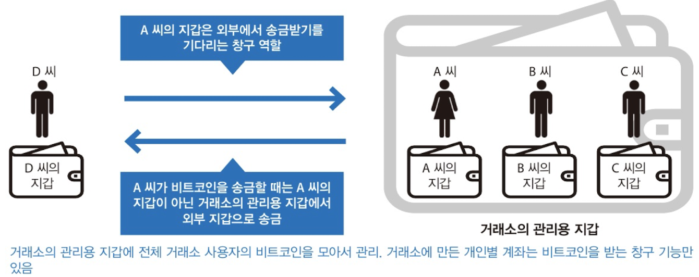

# 비트코인 살펴보기

블록체인과 떼려야 뗄 수 없는 암호화폐 사례인 비트코인에 대해 살펴보자.

## 07 비트코인의 성장 과정

### 제네시스 블록

비트코인은 약 64만 블록까지(2020.09 기준) 연결되어 있다. 현재도 약 10분마다 1개씩 블록이 생성되며 체인에 끝 없이 연결되고 있다. 

제일 처음 만들어진 블록을 제네시스 블록이라고한다. 제네시스 블록의 번호는 0이다.

### 창시자의 메시지

제네시스 블록에는 트랜잭션 하나만 포함되어 있다. 첫 트랜잭션을 열어보면 세계 표준시로 2009년 1월 3일 18:15:05에 해당하는 타임스탬프가 기록되어 있다. 이어서 The Times 03/Jan/2009 Chancellor on brink of second bailout for banks(2009년 1월 3일, 은행들의 두 번째 구제 금융을 앞두고 있음)이라는 상징적인 메시지가 있다.

### 비트코인의 현재

비트코인은 초기 설계부터 전체 발행량이 20,999,999.9769BTC로 정해져 있었따. 보통 2100만 BTC라고 말한다. 처음부터 전체 발행량을 생성한 것이 아닌 채굴(마이닝)이라는 작업으로 블록 하나를 발견할 때마다 보상으로 정해진 양의 비트코인을 주는 것이다. 지금은 어떤 종류의 연산 경쟁을 벌여 먼저 답을 이끌어 낸 사람이 비트코인을 신규 발행해 블록 하나를 만들 권리가 부여되는 것으로만 이해하자.

### 발행 계획

비트코인은 새로운 블록을 채굴할 때마다 고정된 수의 BTC를 발행할 권리를 얻는다. 다음은 비트코인의 블록 번호에 따른 보상을 나타낸 것이다.

*비트코인 블록과 보상*

### 채굴 보상이 없어진다면?

약 130년 후에는 채굴 보상을 얻지 못한다. 이때도 비트코인이 정상 동작할까? 그때는 채굴 보상보다 BTC 거래량이 많이 증가할 것으로 예상되므로 채굴로 얻는 보상 이상으로 트랜잭션 수수료를 더 얻을 것으로 예상한다.

## 08 비트코인과 전자 화페

### 비트코인과 전차 화폐의 차이점

티머니와 같은 전자화폐와 비트코인의 차이점은 원칙적으로 관리자가 없다는 것이다. 비트코인의 가장 큰 가치는 네트워크에 참여하는 사람들 각각의 신뢰에 의존하지 않고 트랜잭션을 자율적으로 공정하게 평가하는 구조를 만든 것이다. 이러한 가치 평가의 핵심은 비트코인 네트워크의 트랜잭션 합의와 승인에 따라 채굴자에게 보상과 수수료를 지급한다는 점이다.

### 비트코인은 어디에 보관하는가?

비트코인은 엄밀히 말해 블록체인에 기록된 숫자일 뿐이다. 전자 화폐처럼 실제 지폐로 교환할 수 없다. 이러한 숫자를 바꾸는데 필요한 키가 바로 지갑니다. 지갑에는 잔액이 아닌 트랜잭션이 들어있다.

## 09 비트코인 처음 사용하기

비트코인 얻는 방법은 다음과 같다.

1. 블록 채굴
2. 실제 화폐를 비트코인으로 교환

이를 통해 얻은 비트코인은 지갑에 들어가게 되고 이를 실제 화폐로 다시 바꾸려면 보통은 거래소를 통하게된다.

## 10 비트코인 지갑

### 지갑의 종류

기본적으로 공개 키 암호 기술 기반의 공개키(받는 주소) 비밀키 쌍(송금용 키)으로 지갑을 만들 수 있다. 직접 만들어 써도 되지만 운용상의 편의성을 고려해 이미 있는 지갑 서비스나 애플리케이션을 사용한다.

지갑을 크게 두 가지로 나눌수 있다. 첫 째로 지갑 서비스 제공자를 신뢰한다는 전제하에 서비스에서 지갑을 만들어 사용하는 거래소 지갑이나 웹 지갑이 있다. 둘 째로 사용자가 직접 지갑을 관리하는 모바일 지갑이나 종이 지갑이 있다.

## 11 비트코인 거래 계좌

### 거래소 선택 시 중요한 점

1. 신뢰할 수 있는가?
2. 수수료가 저렴한가?
3. 트랜잭션 요청부터 처리까지 시간이 얼마나 소요되는가?
4. 자국에서 서비스 하는 거래소인가?

> 일본에서는 2017년 4월부터 거래소를 운영하려면 라이선스를 받도록 법제화하였다.
>

## 12 비트코인 얻기

생략

## 13 비트코인 송금 방법

### 송금에 필요한 것

비트코인 송금 시 자신 지갑의 비밀키와 송금 받는 사람의 공개키가 필요하다. 은행의 계좌번호라고 생각할 수 있다. 

### 송금 과정

송금의 구체적 과정은 위와 같다. 

## 14 보안

비트코인은 전 세계 7000개 이상의 노드에 연결되어 운영 중이다. 덕분에 시스템 자체가 갑자기 중단되거나 파산할 위험은 0에 가깝다. 위험 대부분은 지갑 관리와 관련 있다.

### 비트코인의 위험성

1. 분실 위험
   - 비트코인은 지갑을 이용해 관리하므로 지갑의 비밀키(은행 계좌의 비밀번호에 해당)를 잊으면 지갑 속 자산도 영원히 잃는다.
2. 도난 위험
   - 비밀키가 없으면 마음대로 사용할 수 없다는 것은 비밀키만 있으면 뭐든 할 수 있다는 것이다. 비밀키 도난이라면 모바일 지갑이나 종이 지갑을 도난당하는 것을 떠올릴 수 있지만, 2014년 마운트곡스 해킹 사건처럼 거래소의 지갑이 도난당할 가능성도 있다.
3. 블록의 하드 포크 관련 위험
   - 블록체인은 일시적으로 합의 하지 못했을 때 포크(분기)할 수 있다. 이에 대해서는 32장에서 다룬다.

## 15 비트코인과 블록체인

비트코인을 송금한다는 것은 비트코인의 블록체인에 트랜잭션이 발생한다는 것이다. 그럼 블록체인 안에서는 어떤 일이 일어나는지 구조를 살펴보자.

### 비트코인의 트랜잭션 흐름

지갑의 주인이 다른 지갑에 송금할 때 지급 애플리케이션은 비트코인 네트워크에 트랜잭션을 보낸다. 전송한 트랜잭션이 블록체인에 곧바로 포함되는 것이 아니고 트랜잭션 풀이라는 임시 대기 장소에 저장된다. 이 후 여러 명의 채굴자가 트랜잭션을 블록에 기록하려고 채굴을 시도하고, 채굴이 성공하면 해당 트랜잭션이 비트코인 네트워크에 널리 퍼진 블록체인에 기록된다. 블록체인 성공 빈도는 평균 약 10분이라고 알려져있다. 운이 나쁘면 채굴이 몇 시간 동안 안될 수 있는데 지갑 주인은 마냥 기다릴 수 밖에 없다.

### 오프라인 가게에서의 비트코인 사용

오프라인에서 거래한 이력인 트랜잭션이 블록체인에 반영되기까지 기다릴 수는 없다. 오프라인 가게에서는 비트코인으로 결제할 때는 블록체인에 트랜잭션이 기록되었는지 기다리지 않는다. 송금 완료만 확인하는 제로 컨펌을 사용한다.

### 거래소에서 비트코인을 관리하는 방법

거래소는 사람 각자에게 지갑을 할당해 개개인 소유의 비트코인을 관리한다고 생각할 수 있다. 하지만 실제 운영은 다르다. 거래소 밖에서 거래소 계좌의 지갑 주소로 송금이 가능하므로 개인별 지갑이 있는건 확실하다. 단, 해당 지갑은 송금 받는 창구 역할만 담당한다. 거래소 밖에서 거래소 계좌의 지갑으로 비트코인을 보내면 해당 비트코인 금액을 블록체인이 아닌 거래소 안 개인별 데이터 베이스에 기록한다. 그 후 창구 역할을 하는 지갑에서 거래소의 관리용 지갑으로 옮긴다. 

