# Chapter 3. 블록체인을 지원하는 암호화 기술 이해하기

## Lesson 16. 정보 시스템을 지원하는 현대 암호화 기술

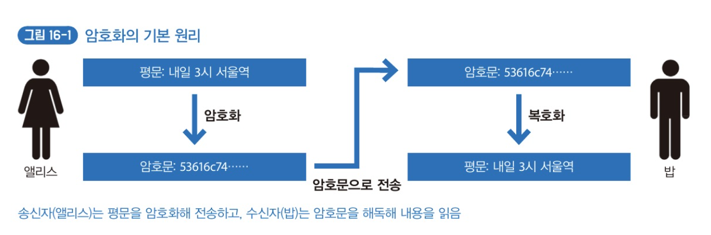

- 평문: 사람이 이해하는 문장.
- 암호문(암호): 암호화한 문장.
- 암호화(Encryption): 사람이 이해하는 문장을 어떤 규칙에 따라 이해하지 못하는 형태로 변환해 비밀을 교환하는 것.
- 복호화(Decryption): 암호문을 평문으로 되돌리는 것.

컴퓨터가 발전하며 현대의 암호화 기술은 과거와 비교해 비밀을 교환하기 위한 도구에서 벗어나 **일상 생활의 안전을 지키는 파수꾼**으로 변하였다. 문서의 비밀 보호만을 목표로하지 않고 다양한 특징을 갖게 되었다.

- 문서 접근 권한을 특정 사람에게만 한정함.
- 문서 내용이 변경되지 않았음을 보장함.
- **문서 작성자의 서명을 검증하거나 증명함.**
- 문서가 어느 시점에 만들어졌는지 증명함.
- 문서에 포함된 내용을 부인하지 못하도록 함.

블록체인은 암호화 기술의 특성을 적절히 이용해 당사자 두 사람 사이뿐만 아니라 **네트워크에 참여하는 모든 사람이 암호화 기술의 장점을 누릴 수 있는 구조**로 되어 있다. 그러므로 블록체인을 제대로 이해하려면 암호화 기술을 이해하는 것이 중요하다.

암호화의 요소에는 `암호 만들기(암호화)`, `암호 풀기(복호화)`, `암호 만들기와 풀기에 사용하는 키` 가 있다. 오래존부터 존재하는 많은 암호화 방식이 있는데, 공통적인 특징은 암호화와 복호화 방법, 암호를 푸는 키를 외부에 알리지 않아야 한다는 점이다.

그러나, **수학 이론을 기반으로하는 컴퓨터가 발전한 이후의 현대 암호화 기술에서는 암호화, 복호화, 키를 만드는 방법 자체는 더 이상 비밀이 아니다. 비밀로 해야하는 부분은 공개된 방법대로 만든 개별 키 자체이다.**

현대 암호화 기술은 `대칭 키 암호(Symmetric Key Cryptography)`와 `공개 키 암호(Public Key Cryptography)` 방식을 사용한다.

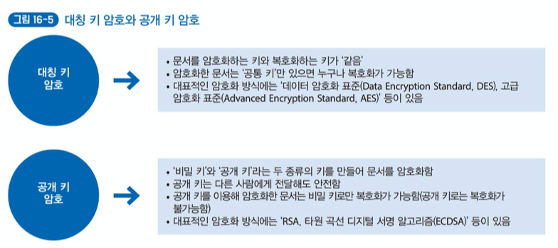

**블록체인에서는 공개 키 암호 방식을 많이 사용하며, 특히 다른 공개 키 암호방식보다 키 길이가 짧은 `타원 곡선 암호(Elliptic Curve Cryptography)`를 자주 사용한다.**

## Lesson 17. 특정 사람만이 정보에 접근하는 공개 키 암호

블록체인처럼 여러 참여자가 있는 네트워크에서 특정 사람에게만 문서 접근과 제어 권한을 부여할 때는 '공개 키 암호'가 유용하다. 공개 키로 암호화한 문서는 비밀 키로만 복호화 할 수 있기 때문이다. 즉, **특정 사람만 어떤 작업이 가능한 구조를 만드는 데 적합하다.**

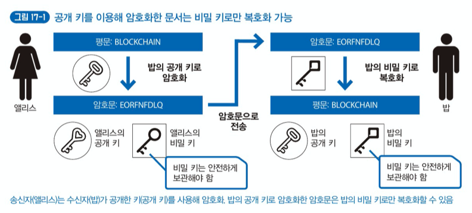

이렇게 공개 키 암호를 사용하면 암호를 푸는 키(비밀 키)를 바꿀 필요가 없다. **그렇지만 공개 키 암호화 방식의 경우 대칭 키 암호 방식과 비교했을 때 계산 시간이 훨씬 오래 걸리기(= 복호화에 오래 걸린다.) 때문에, 용량이 큰 데이터를 암호화할 때 적합하지 않다.**

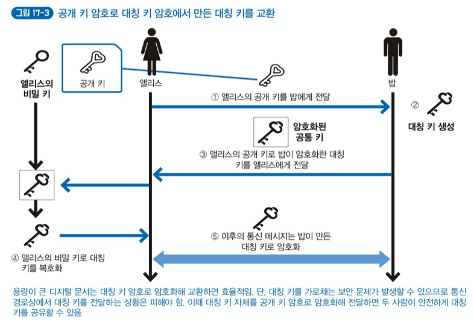

> HTTPS(SSL/TSL) 등의 경우도 보통 대칭 키 자체를 서로 주고받을 때 공개 키 암호 방식을 사용한다.

블록체인에서는 'RSA' 공개 키 암호화 방식보다 타원 곡선 암호 기반의 타원 곡선 디지털 서명 알고리즘(Elliptic Curve Digital Signature Algorithm, ECDSA)이라는 공개 키 암호를 많이 사용한다.

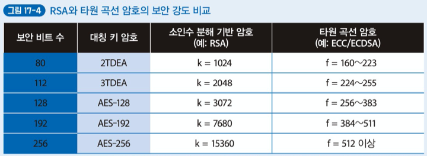

타원 곡선 디지털 서명 알고리즘의 경우는 RSA와 비교했을 때 상당히 짧은 키만 사용해도 같은 정도의 보안 강도를 유지할 수 있다. 그러므로 발행된 모든 트랜잭션에 전자 서명을 해야하는 블록체인 네트워크에서는 처리 속도가 상대적으로 빠른 타원 곡선 암호가 RSA보다 블록체인에 더 적합하다.

## Lesson 18. 안전한 암호 키를 생성하는 난수 생성법

현대 암호학에서는 암호화에 사용되는 키를 얼마나 안전하게 보호하는지가 중요하다. 또한, 대칭 키 암호나 공개 키 암호 같은 기술과 상관없이 **기반이 되는 키를 생성할 때 (규칙성이 없는) 예측 불가능한 난수를 얻느냐에 따라 안전성이 결정된다.**

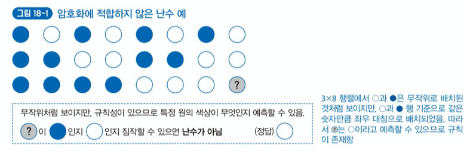

진정한 난수는 규칙성이 없으므로 당연히 재연성도 없다. 그러나 컴퓨터는 규칙성이나 재현성이 없는 예측 불가능한 동작을 계속하는 데 매우 서툴다. **컴퓨터가 생성하는 난수는 `유사 난수`라고 한다.** 유사 난수를 만드는 논리를 포함하는 프로그램을 '유사 난수 생성기'라고 한다. '유사'라는 접두어를 사용하는 이유는 실제로 **어떤 함수에 넣은 입력값으로 사람에게는 규칙성이 없는 것처럼 보이는 난수를 만들기 때문이다.** 함수는 같은 값을 입력하면 항상 같은 출력값을 얻는 특성이 있다. **유사 난수 생성기도 함수를 사용하므로 예외 없이 재현성과 예측 가능성이 보장된다.**

유사 난수 생성기에 난수의 씨앗인 '시드'라는 값을 넣으면 난수로 보이는 값을 출력한다. 그러나 유사 난수 생성기는 시드 값이 같으면 항상 같은 난수를 얻는 특징이 있다. 즉, 순수한 난수가 아니므로 '유사'라고 하는 것이다.

암호용 키에 필요한 안전한 난수를 생성하고자 다양한 방법을 사용한다. **사용자의 마우스 커서를 적당히 움직였을 때의 좌표 변화를 시드 값으로 사용한다거나, 스마트폰 터치스크린의 손가락 움직임에 따라 난수를 생성하는 간단한 게임을 준비하거나, 스마트폰의 기울기 정도나 진동의 변화를 바탕으로 시드 값을 생성하는 것** 등이 있다.

> 사람이 직접 임의의 난수를 만들려고 하면 무작위로 보이게 하려는 의식에 사로잡혀 결과적으로는 무작위가 아니게 된다.

## Lesson 19. 디지털 문서의 손상을 감지하는 '단방향 해시 함수'

블록체인 기술의 가장 중요한 개념 중 하나가 `단방향 해시 함수` 이다. 보통은 `단방향` 이라는 용어는 빼고 `해시 함수` 나 `해시` 라고 한다. 해시 함수를 이용한 해싱은 암호화 복호화와 다르게 해싱 함수를 통해 나온 결과를 입력값으로 되돌릴 수 없다.

블록체인 관련 프로젝트에서는 주로 SHA2-256 해시 알고리즘을 사용한다. 해시 함수는 같은 알고리즘을 사용할 때, 같은 값을 넣으면 항상 같은 값을 결과로 얻을 수 있다. 또한 길이가 다른 입력 값을 사용하더라도 항상 일정한 자릿수의 값을 얻는다.

> SHA-256 알고리즘을 이요한 해시 함수는 입력값이 1바이트든, 1메가바이트든, 1기가바이트든 출력값은 항상 64자리의 16진수로 고정된다.

## Lesson 20. 해시 함수의 충돌 저항성

해시 함수는 여러 종류가 있다. 해시 함수의 알고리즘(해시 알고리즘)이 다르면 같은 입력값을 넣어도 서로 다른 출력값을 얻는다. 결과 자릿수도 각각 다르다.

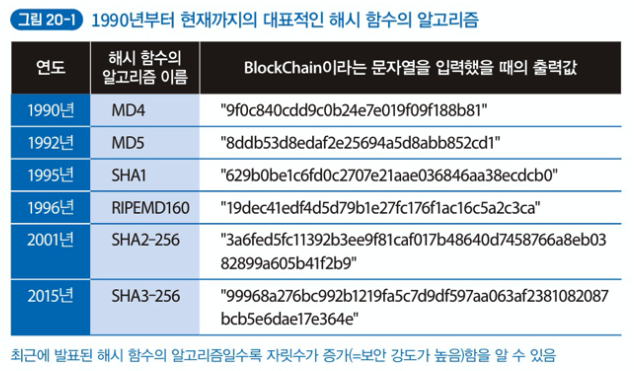

많은 해시 알고리즘을 새로 개발하는 이유는 보안을 더 강화하기 위함이다. 해시 알고리즘의 충돌이 덜 발생할 수록 더 높은 보안성을 가질 수 있다.

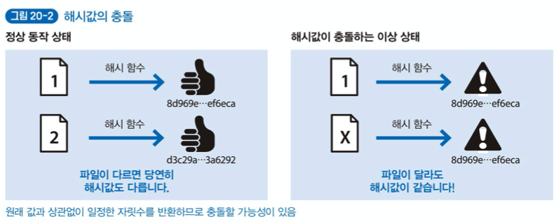

SHA2-256의 경우 충돌이 발생할 확률이 1/2의256승 이다. 2020년 9월을 기준으로 MD4, MD5, SHA1까지 충돌하는 해시 값이 발견됐다. SHA1의 경우에는 구글이 충돌 해시 값을 찾는 데까지 22년 동안 유효했고, 충돌 해시 값을 찾는 데 걸린 계산 횟수만 900경 이상이다. 일반적인 CPU라면 6,500년, GPU를 사용해도 110년 정도 계산이 필요한 횟수이다.

SHA1은 충돌이 발견됐기 때문에 암호학적으로는 더는 안전하지 않지만, 실용성을 완전히 잃은 것은 아니다. 현재 가장 많이 사용되는 해시 알고리즘은 SHA2-256이다.

## Lesson 21. (중요) 디지털 문서의 작성자를 증명하는 '전자 서명'

`전자 서명` 은 디지털 문서의 작성자를 증명하는 기술이다. 그러나 전자 서명만으로는 데이터 바꿔치기나 스푸핑(Spoofing, 속임수) 문제를 근본적으로 막지 못하므로 정말 본인이 직접 해당 암호 키로 서명한 것인지 증명하는 과정이 필요하다.

**전자 서명은 암호 기술의 정교한 조합으로 구현한 것이다.** '누가 무엇을 했는지'를 증명하는 프레임워크라고도 할 수 있다. 보통 인터넷에서 교환하는 문서가 본인이 작성한 것임을 확인하는데 사용하며, 모든 비즈니스 거래에 유용하다. 블록체인에서는 기록된 트랜잭션에 전자 서명을 포함하고 있다.

**`전자 서명`은 `공개 키 암호화 방식`과 `단방향 해시 함수`의 성질(특징)을 이용한다.**

- 단방향 해시 함수: 송신자와 수신자 모두 평문의 해시 값을 계산하면 문장(데이터)이 같을 때, 해시 값도 같다. 
- 공개 키 암호화 방식: 공개 키 암호화 방식의 공개 키로 암호화한 문서(전자 서명은 문서의 해시값)는 비밀 키로만 복화할 수 있다.

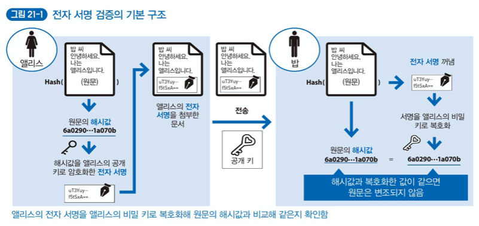

전자 서명은 송신자에게 받은 `(송신자가 만든) 전자 문서`, 첨부된 `(디지털 문서의) 전자 서명`, `(송신자의) 공개 키` 조합을 이용한다.

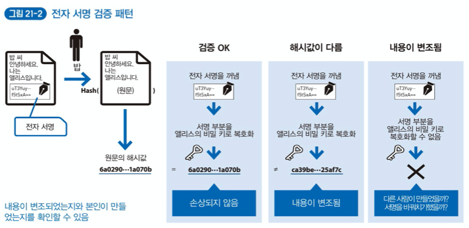

공개 키 암호의 키 쌍(공개키와 비밀키)은 누구나 자유롭게 만들 수 있기 때문에, 전자 서명이 확실한 서명 검증 수단이더라도 검증에 사용한 공개 키가 정말 송신자의 것인지 의심이 들 수 있다. **결국 전자 서명이 있다는 사실로는 공개 키에 대응하는 비밀 키가 있는 사람이 전자 서명을 했다고는 할 수 있지만, 정말 그 본인이 전자 서명을 했는지는 증명하기 어렵다.**

본인과 거래했는지 확실히 하고 싶은 경우, 본인과 직접 만나 받은 공개 키로 문서를 교환하면 쌍을 이루는 비밀 키로 만든 전자 서명은 본인이 한 것이라 확신할 수 있다. 이 과정에서 `핑거프린트(Fingerprint)` 를 자주 사용한다. 공개 키의 해시 값에서 사람에게 전달하기 쉬운 핑거프린트 정보를 만든 후 암호화와 복호화에 사용하는 것이다. -> **전자 서명 검증에 사용되는 공개키 자체에 대한 소유권을 인증하는 것이라고 볼 수 있다.**

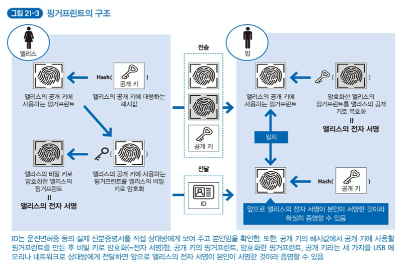

핑거프린트를 사용해서 전자 서명에 사용되는 키 쌍이 정말 상대방의 것인지 확신할 수 있다. **그러나 새로운 문서를 처음 교환할 때마다 상대를 직접 만나는 것은 현실적이지 않다.** 키를 쉽게 전달하는 방법의 하나로 자신의 공개 키 해시값에 해당하는 핑거프린트를 퍼블릭한 공간에 공개하는 것이다. 핑거프린트를 공개해 두면 공개키를 획득한 사람은 본인이 획득한 공개 키의 해시값과 공개되어 있는 핑거프린트를 비교해 일치하는지 검증할 수 있다.

**하지만 불특정 다수의 사람에게 일일이 핑거프린트 검증을 요구하기는 현실적으로 어렵다.** 또한, 핑거프린트 검증이 중요한 기술이라도 해당 기술을 강제하는 것은 대중화의 걸림돌이 되기도 한다. 실제로 상호 간 통신 암호화에 특화되어 핑거프린트 확인을 사용자에게 강제하는 PGP(Pretty Good Privacy)나 GPG(GNU Private Guard) 같은 공개 키 암호 기술은 널리 보급되지 못하고 있다.

## Lesson 22. (매우 중요) 전자 서명이 진짜임을 증명하는 '전자 인증서'

**본인의 전자 서명인지 확실하게 증명할 때는 Lesson 21처럼 일대일로 증명하는 방법 이외에 신뢰할 수 있는 제3자에게 증명을 맡겨 효율을 높일 수 있다. 이는 `인증 기관(Certification Authority, CA)`을 거치는 방법으로 발전했다.**

**인증 기관은 공개 키 암호화 방식의 공개키 소유자를 사람이나 조직에 연결해 관리한다.** 보통 누구나 신뢰할 수 있다고 생각하는 곳에서 운영한다. (인증 기관을 운영하는 곳은 민간 기업이나 정부, 지방 자치 단체 등이 있다.)

인증 기관은 전자 서명이 본인의 것임을 증명하고 싶은 사람의 공개 키를 보관한 후 이를 이용해 본인인지를 확인한다. 이때 본인 확인의 유효성을 관리하고자`전자 인증서(Electronic Certificate)` 를 발급한다.

**인증 기관이 본인임을 확인해 전자 인증서를 발급하고 유효성을 관리하는 구조를 `공개 키 기반구조(Public Key Infrastructure, PKI)` 라고 한다.** 또한, 공개 키 기반 구조 중 정부 등의 행정 기관이 운영하는 것은 특별히 '행정 공개 키 기반 구조(Government Public Key Infrastructure, GPKI)'라고 구분한다.

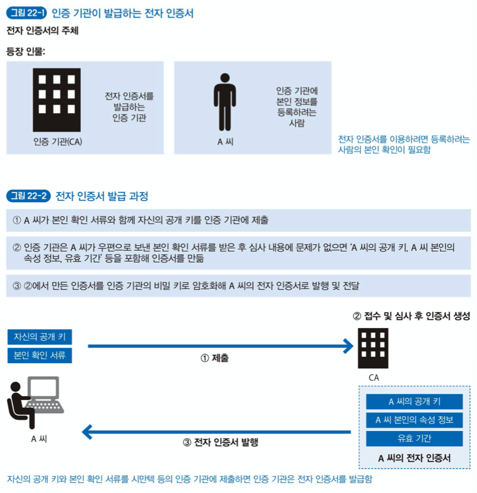

지금까지는 전자 인증서가 무엇인지에 대해 알아보았다. 그런데 **인증 기관마다 서로 다른 형식의 전자 인증서를 사용할 경우 인증을 자동으로 처리할 수 없다. 이런 문제를 해결하고자 `X.509` 라는 표준 서식이 만들어졌다.**

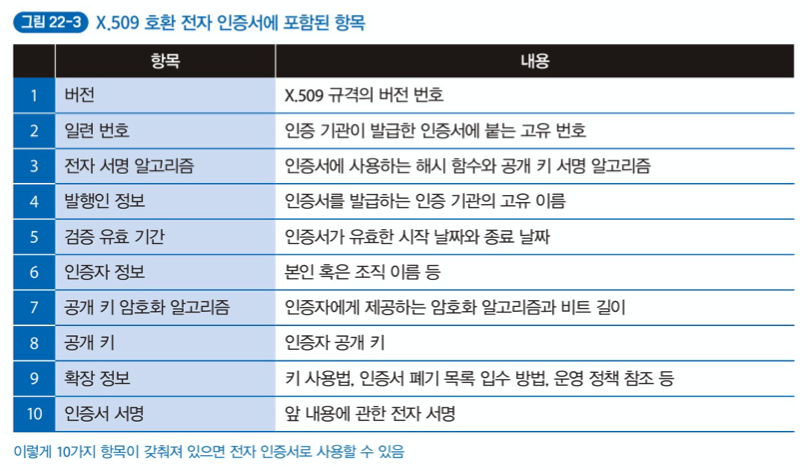

## Lesson 23. 디지털 문서 생성 시간을 증명하는 '타임스탬프'

`타임스탬프` 는 암호 기술이 아니다. 그러나 전자 서명에서 시간을 근거로 디지털 문서의 존재를 증명하는 데는 필수이다. 블록체인을 지원하는 기술로서도 중요하다.

타임스탬프는 파일을 새로 만들거나 내용을 변경했을 때 운영체제가 자동으로 부여하는 시각이다. 협정 세계시(UTC) 1970년 1월 1일 0시 0분 0초를 기준으로 관리한다.

> 왜 1970년부터 시작인가?
>
> 컴퓨터가 발명된 시기와 그 당시의 메모리 용량이 적다는 것을 고려했기 때문이다. 그 당시 컴퓨팅 자원으로도 시각 기록에 무리가 없다는 기준에서 비교적 최근 날짜를 선택한 것이다. 이후에 만든 컴퓨터의 시각 관리는 대부분 1970년을 기준으로 한다.

전 세계의 컴퓨터 각각은 독립적으로 동작하므로 시각도 독립적으로 관리한다. 그러므로 컴퓨터마타 최소 몇 초 정도 시각 차이가 존재할 가능성이 높다. 네트워크에 연결된 컴퓨터의 시각을 맞추려는 네트워크 타임 프로토콜(Network Time Protocol, NTP)이 있지만, **네트워크 지연 등의 이유로 노드 각각의 타임스탬프를 엄격하게 맞추기가 의외로 어렵다.**

블록체인에서 사용하는 타임스탬프 기술은 '분산 타임스탬프' 기술의 하나이다. 개별 트랜잭션에 포함된 타임스탬프의 정밀도는 낮지만, 여러 트랜잭션의 타임스탬프를 '블록' 단위로 비교한 후 비슷한 시각의 타임스탬프를 선택하는 방법을 사용하면, 신뢰할 수 있는 정밀도와 정확성을 보장할 수 있다는 특징이 있다.

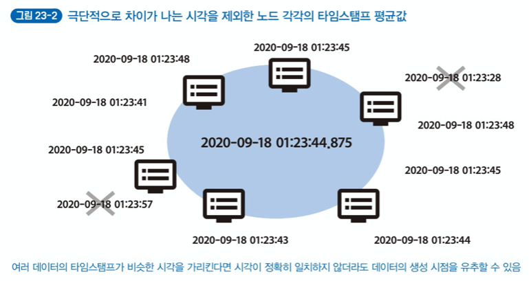

**지금까지 살펴본 '해시, 전자 서명, 공개키 기반 구조, 타임스탬프'는 블록체인의 특징을 이해하는 데 필요한 암호 관련 기초 지식이다.** 이러한 기술의 조합으로 탄생한 블록체인의 특징은 다음과 같다.

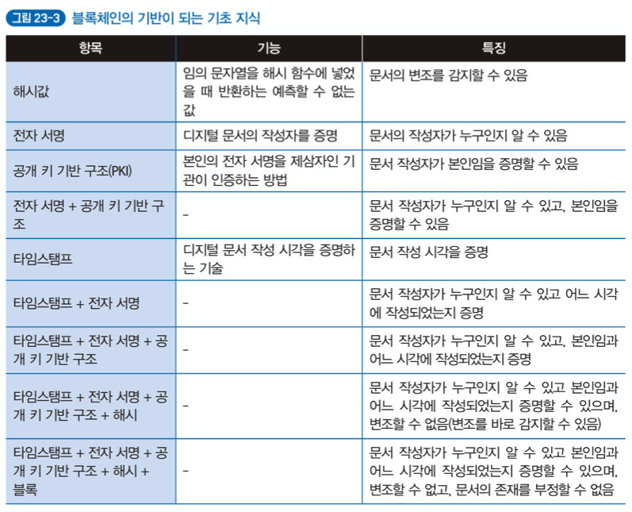