# 블록체인을 지원하는 분산 시스템

이 장에서 알아볼 것

- P2P 분산 네트워크 시스템의 특징
- 네트워크 노드 사이 합의 형성 방법
- 작업 증명과 지분 증명 알고리즘

## 25 P2P 분산 시스템

많은 컴퓨터가 함께 동작하는 시스템을 분산 시스템이라고 한다.

### P2P 방식의 분산 네트워크

2개 이상의 노드가 서로 일대일로 연결되어 통신하는 방법을 P2P라고 한다. P2P로 연결된 노드가 많이 모이면 P2P 방식으로 연결된 네트워크가 형성되는 것이다.

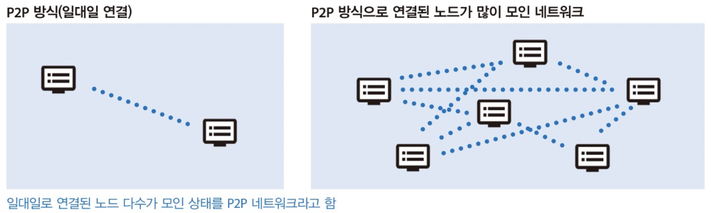

> 위와 같은 네트워크 구성을 메시 네트워크라고한다. 모든 노드가 연결된 상태는 완전 메시 네트워크라고 구분한다.

### P2P 분산 네트워크의 특징

P2P 네트워크 상의 노드는 원칙적으로 같은 역할을 수행한다. 일부 노드만 특별한 역할을 부여할 수 없으므로 단일 장애점(Single Point Of Failure, SPOF)가 없다. 특정 노드가 고장 나 정지하더라도 전체 네트워크에 영향을 주는 일이 적고, 규모가 커질수록 복원력이 뛰어나다. 비트코인은 7,500개 이상의 노드가 함께 동작하고 있다.

### 블록체인의 분산 시스템

블록체인은 네트워크에 참여한 모든 노드가 같은 데이터를 유지하는 P2P 네트워크이다. 같은 데이터를 유지하는 방법은 해시 함수이다. 노드가 처음 네트워크에 참여할 때 다른 노드에 있는 블록체인 데이터의 해시 함숫값을 비교하며 블록 하나하나를 신중하게 복사한다. 따라서 네트워크 참여에 오랜 시간이 걸린다. 하지만 복사를 마치면 네트워크 노드의 하나가 되어 블특정 다수의 이용자가 발행하는 트랜잭션을 남길 수 있다.

## 26 P2P 방식의 특징

### 장점

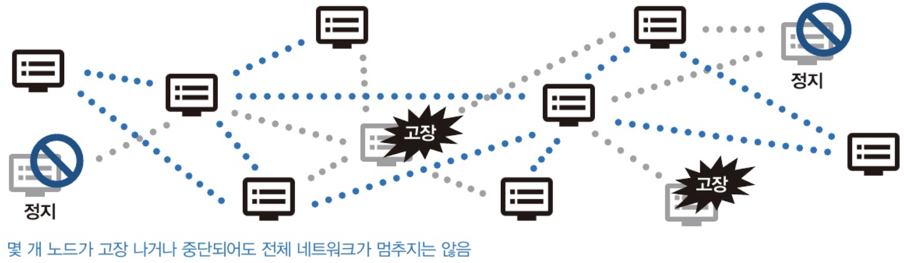

 P2P 방식의 가장 큰 장점은 사고 등으로 전체 시스템이 멈출 위험이 매우 낮다는 것이다. 

### 단점

P2P 네트워크는 멈추지 않고 계속 작업하는 시스템을 만든다는 부분만 강화한 구조다. 인공지능이나 과학 계산 클러스터링처럼 노드를 늘리면 늘릴수록 성능이 향상되는 시스템에는 적합하지만, 반대로 노드가 많을수록 버킷릴레이 양이 많아지므로 전체 성능은 나빠진다.

> **❓ 버킷 릴레이**
>
> 화재 등이 발생했을 때 여러 사람이 한 줄로 서서 양동이를 전달해 불을 끄는 일에서 유래. 여러 노드에서 데이터를 계속 전달하는 상황을 뜻한다.

또한 문제가 발생해도 시스템을 쉽게 중지시킬수 없기도하다. 악의적인 데이터가 퍼지면 제거가 어려우므로 사고가 발생할 확률이 높다.

## 27 CAP 정리로 살펴보는 블록체인

### CAP 정리

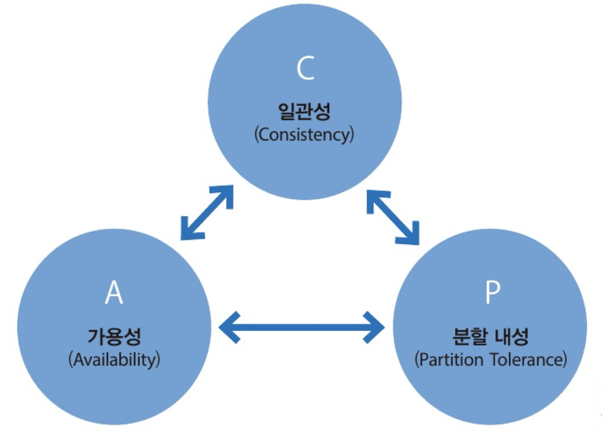

인터넷 서비스 제공자는 보장해야할 세가지 특성이 있다.

- 일관성(Consistency)
  - 사용자가 서비스 접속 시 항상 최신 정보를 제공
- 가용성(Availability)
  - 서비스가 멈추지 않음을 보장
- 분할내성(Partition Tolerance)
  - 네트워크의 어느 지점이 끊어지더라도 서비스가 멈추지 않음

CAP 정리는 이 세가지 특성을 동시에 충족할 수 없다는 것이다. 블록체인은 이 CAP 정리에서 가용성과 분할 내성을 보장하고 일관성을 희생하므로 AP 시스템이라고 불린다.

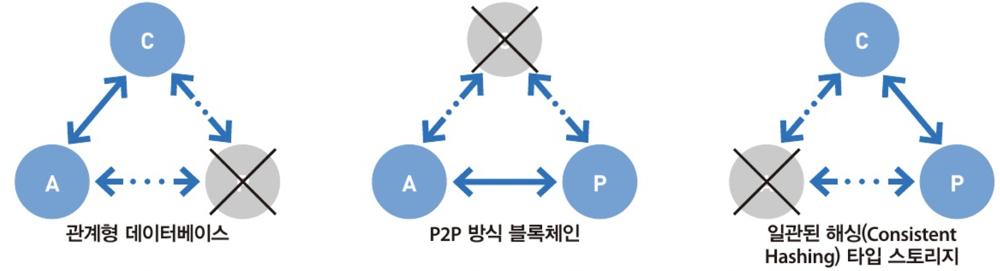

### CAP 정리로 보는 블록체인의 특성

블록체인의 장점은 가용성과 분할 내성을 보장하는 것이다. 노드 각각이 P2P 방식으로 통신하므로 네트워크 연결이 조금 끊어져도 서비스는 멈추지 않는다. 

하지만, 일관성은 약한 편이다. 예를들어 비트코인은 전 세계에 7,500개 이상의 노드가 서로 통신하며 작동한다. 이 네트워크에 어떤 데이터를 기록하면 모든 노드에 반영되기까지 시간이 소요된다. 서로 떨어진 곳에 있는 두 노드에 서로 다른 데이터가 거의 동시에 기록되면, 데이터 기록 순서가 바뀔 수도 있다.블록체인 기술을 순서가 중요한 거래 사용하는 것이 적합하지 않은 이유다. 하지만, 일정 시간 후에는 모든 노드에 데이터가 기록되므로 블록체인의 일관성이 보장된다고 볼수도 있다. 

## 28 컨텐츠 주소

블록체인 데이터 스토리지 기술도 P2P 분산 기술을 응용한다. P2P 분산형 데이터 스토리지의 특징인 컨텍트 주소라는 파일 관리 방법의 개념을 알아보자.

### 블록체인은 데이터 스토리지

블록체인도 데이터 스토리지이다. 좀 특별한 P2P 분산 데이터 스토리지이다. 원칙적으로 트랜잭션이라는 거래 데이터만 기록가능하며 이미지 파일이나 워드 파일 그대로를 기록할 수 없다. 

### 컨텐츠 주소

P2P 분산 데이터 스토리지에 데이터를 저장할 때는 여러 데이터 중 기록해야할 파일만 구분하는 문제를 해결해야한다. 분산된 노드에 자유롭게 데이터를 기록할 수 있다고 해도, 파일 이름을 마음대로 붙이면 데이터 일관성이 깨지기 때문이다.

전 세계에 같은 파일 이름이 있는지 확인 후 파일을 저장하자고 말할 수도 있다. 하지만 분산 시스템 특성상 실시간 일관성을 보장하지 않으므로 우연히 같은 시점에 같은 파일 이름을 붙여 저장하는 사고가 발생할 수 있다.

이 때 단방향 해시 함수를 사용해 저장할 파일의 해시값을 생성한 후 주소로 사용한다. 이렇게 하면 다른 파일 주소와 겹칠 일이 없다는 장점이 있다. 이를 컨텐트 주소라고한다.

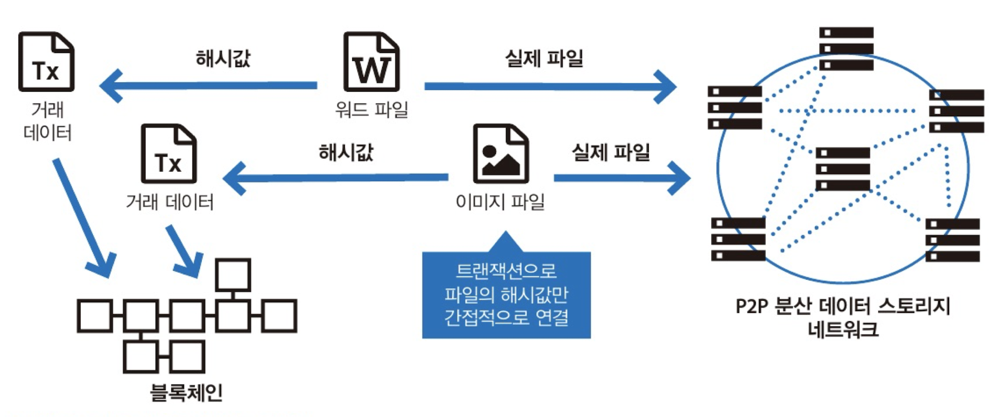*실제 파일은 P2P 분산 데이터 스토리지에 저장, 파일의 해시값은 블록체인에 저장*

일단 P2P 분산 데이터 스토리지에 저장된 데이터는 내용을 수정하거나 삭제할 수 없다. 이를 통해 내용 변조를 꼭 막아야 하는 계약서나 이력서 등을 P2P 분산 데이터 스토리지에 저장하면 굉장히 유용할 것이다.

## 29 블록체인의 분기

블록체인 네트워크를 형성하는 노드의 역할 중 합의 형성이 있다.  이는 분산 컴퓨팅 연산으로 수행한다. 합의 형성에 필요한 연산 방법과 노드의 연산 결과가 다를 때 어떻게 대응하는지 살펴보자.

### 분산 컴퓨팅

분산 컴퓨팅은 여러 대의 컴퓨터가 역할을 나눠 동시에 연산을 수행해 고속 처리를 구현하는 기술이다. 따라서 작업을 할당하는 관리자 노드가 필요하다. 

그러나 블록체인의 분산 컴퓨팅은 상황이 조금 다르다. 모든 노드가 연산을 수행한다. 그럼 결과가 모두 같을까? 이는 누구도 보장하지 않는다. 그래서 각 노드의 연산이 끝나면 모든 노드의 연산 결과가 확실히 같은지 확인(합의)해야한다.

### 분산 노드의 연산 결과가 다르다면?

모든 노드가 수행한 연산의 결과가 다르면 합의를 할 수 없어 블록체인이 나눠진다. 이때 노드 각각은 옳다고 생각하는 결과에 따라 블록을 연결하는데, 블록의 높이(길이) 차이가 발생하면 더 높은 블록체인을 선택해 결과적으로 합의를 형성한다.

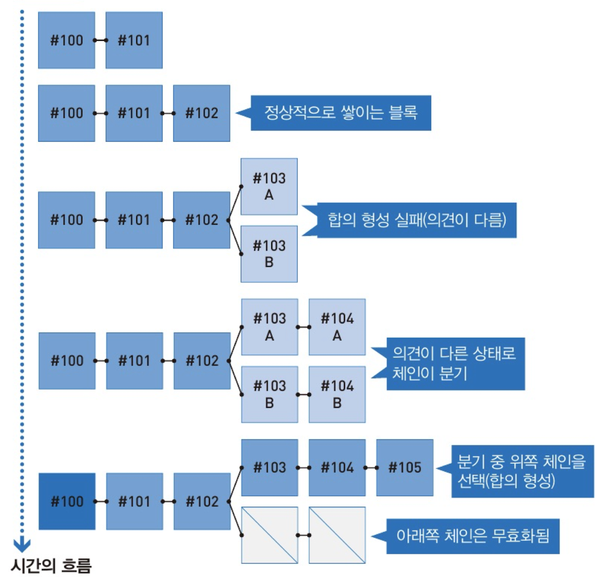

*블록체인의 분기*

## 30 합의 형성 구조

### 다수결 합의

블록체인은 모든 노드가 같은 작업(트랜잭션 처리와 연산 작업)을 한다. 따라서 보통은 만장일치로 같은 결과가 나올 것이다. 문제는 일부 노드의 작업 결과가 다를 때이다. 이럴 땐 다수결로 작업 결과를 선택한다. 실제로 다수결로 합의를 형성하는 블록체인도 많다. 

### 퍼블릭체인의 다수결 합의

다수결은 구체적으로 전체 참여자의 절반 이상이 선택한 의견을 전체 의견으로 정하는 것이다. 하지만 퍼블릭 체인은 현재 네트워크에 참여한 모든 노드의 수를 정확하게 파악할 수 없다.

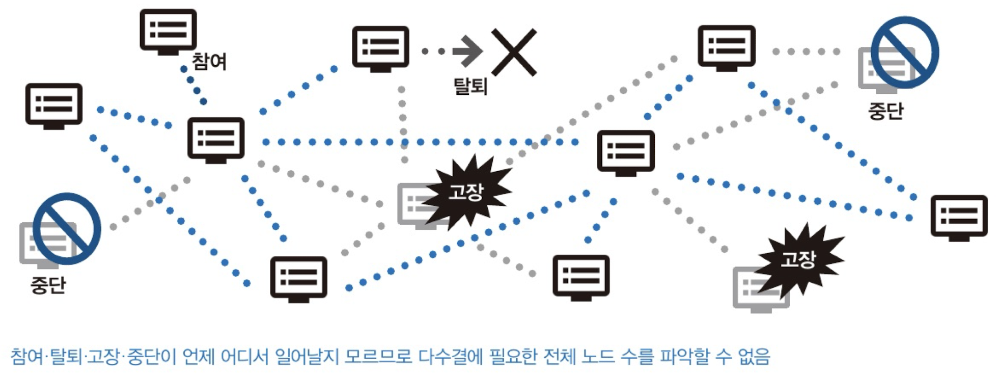

### 리더가 필요한 합의

프라이빌 체인이라면 전체 참여자 수를 알기 때문에 리더를 정한 후 그 의견에 따라 합의를 형성하는 것이 합리적이다. 블록체인 이전 중앙화 시스템은 합의 대신 관리자의 판단으로 결정했다. 분산 시스템에서는 리더가 선택할 결과를 먼저 제안후 다수결에 따르는 형태로 합의를 형성한다.

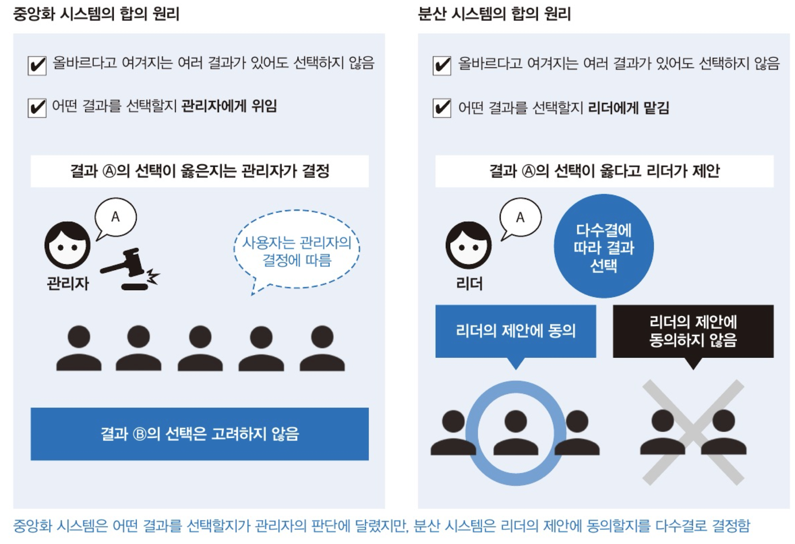

### 리더가 필요 없는 합의

전체 참여자 수를 알 수 없는 퍼블릭 체인은 다수결로 합의를 형성하기 어렵다. 대신 경제적 보상을 통해 합의를 한다. 즉, 올바른 선택을 한 사람은 경제적 보상을 행사할 권리를 얻을 수 있고, 그렇지 않으면 권리를 얻지 못하는 구조인 것이다. 이 합의 형성 알고리즘에는 작업 증명과 지분 증명이 있다.

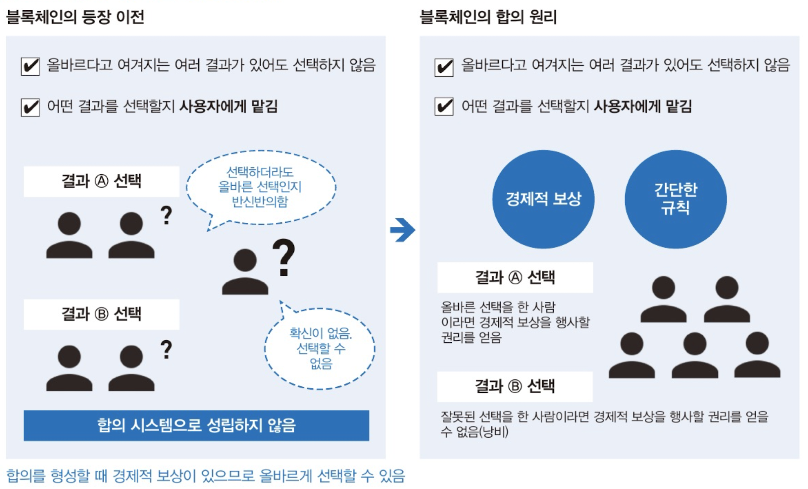

## 31 합의 형성과 암호화폐

퍼블릭 체인 시스템이 선택한 전략은 올바른 결정을 한 사람이 결과적으로 경제적 이익을 얻는다는 간단한 개념이다. 이것을 비잔티음 장애 허용(Byzantine Fault Tolerance, BFT) 알고리즘이다. 비잔티움 알고리즘에는 작업 증명과 지분 증명이라는 두 가지 알고리즘이 있다.

### 작업 증명 알고리즘

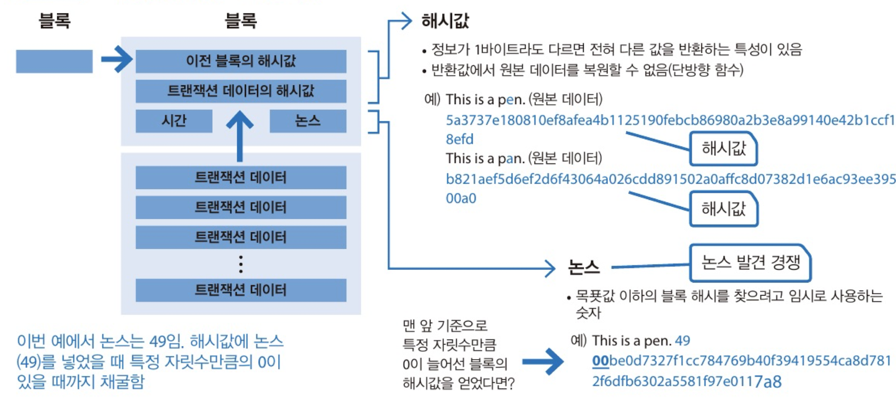

작업 증명은 불특정 다수 참여자의 합의를 형성하는 구조이다. 노드는 트랜잭션 풀에 쌓이는 트랜잭션 데이터를 수십, 수백 개 꺼내면서 이전 블록의 해시값과 타임 스탬프를 블록에 포함한다. 또한 논스라는 적당한 수를 넣으면서 해당 블록 해시값 앞에 특정 자릿수만큼 0이 있을 때까지 계속 연산한다.

이 논스 발견 경쟁이 작업 증명의 핵심이다. 특정 자릿수만큼 0이 있는 논스를 순조롭게 찾은 노드는 암호화폐의 신규 발행을 인정 받는다. 이를 채굴이라고 한다.

### 지분 증명 알고리즘

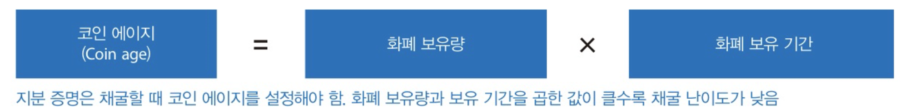

*지분 증명의 기본 개념*

작업 증명은 대량의 컴퓨팅 자원을 이용하므로 친환경적이지 않다. 이를 해결하려고 나온 것이 지분 증명이다. 지분 증명 역시 경제적 보상을 판단 기준으로 삼아 불특정 다수의 참여자를 허용하는 합의 형성 알고리즘이다. 위 그림의 코인 에이지 설정 값이 클수록 채굴 난이도가 낮다. 단, 이러한 방식은 화폐 보유량이 많을수록 보상도 크므로 부익부 빈익부 구조가 되기 쉽다. 

> 비교적 최근에 등장한 퍼블릭 블록체인은 작업 증명보다 지분 증명 방식의 합의 형성 알고리즘을 더 많이 적용하는 편이다.

## 32 블록이 분기했을 때의 해결 방법

### 작업 증명은 정말 제대로 동작하는가?

작업 증명은 겉보기에 정상적인 합의가 맞는지 의심스러울 때도 있다. 작업 증명에서 어떠한 조건을 만족하는 문자열이 포함된 해시값을 찾을 수 있을지는 운에 좌우될 때가 많다. 비트코인의 블록체인은 평균 10분 정도에 찾도록 설계했다. 따라서 의도와는 다르게 2개 이상의 노드가 거의 동시에 해시값을 찾는 상황이 자주 발생하는데, 이 때 여러 개의 처리 결과르 ㄹ동시에 기록해 마치 평행 세계가 존재하는 것 같은 상태가 된다. 즉 블록체인에 분기(포크)가 발생한 상황이다.

### 분기가 발생했을 때의 합의 형성

합의 형성이 실패하면 블록체인이 분기한다. 이때 노드 각각은 자신의 연산 결과에 따라 옳다고 판단하는  결과로 블록을 늘린다. 블록체인 시스템은 블록 높이가 큰 체인을 올바른 결과로 판단해 선택한다. 선택 받은 체인은 보상을, 그렇지 못한 체인은 보상을 주지 않는다(비활성화).

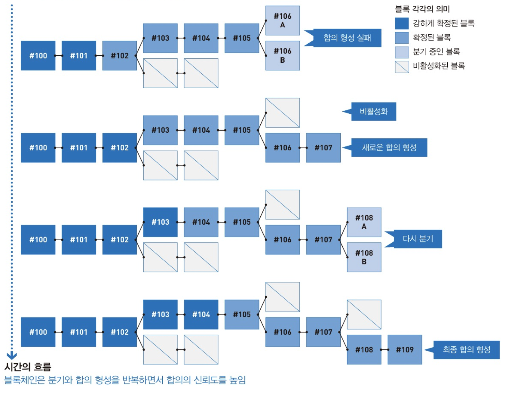

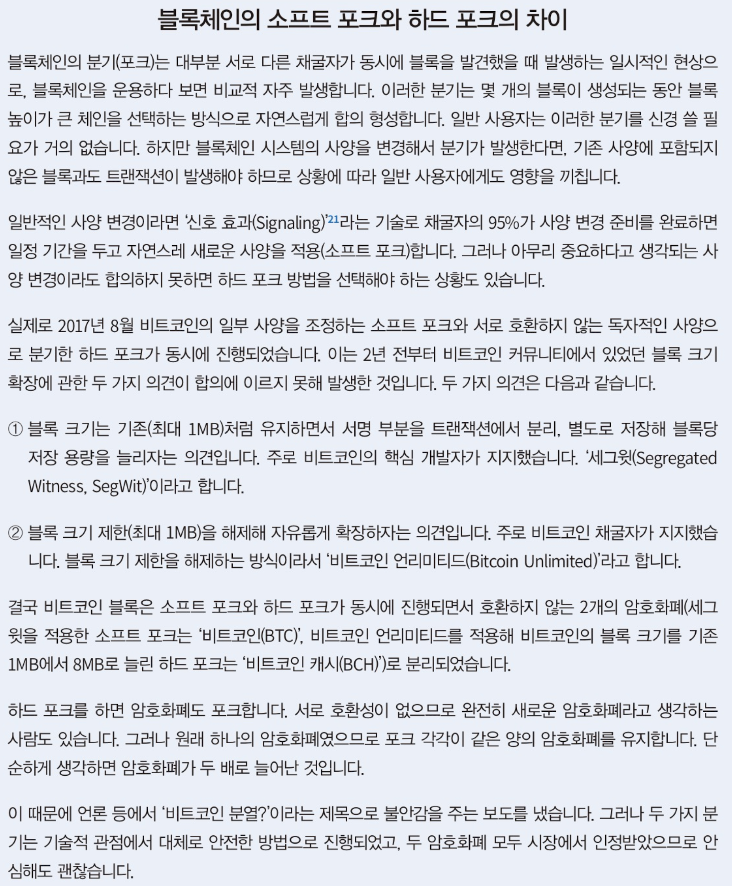