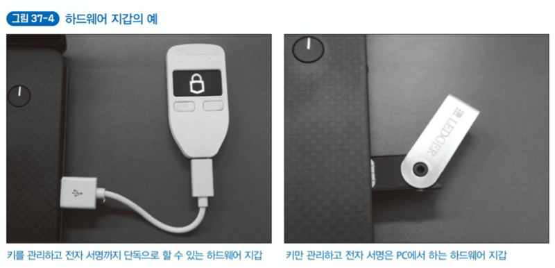

# Chapter 5. 지갑의 구조 이해하기

## Lesson 33. '지갑'은 암호화폐의 잔액을 확인하는 수단

암호화폐의 '지갑'에 대한 의미는 다음과 같다.

1. 모바일 앱과 웹 서비스로 '잔액 조회'나 '송금' 기능을 제공하는 인터페이스
2. **블록체인에서 사용하는 공개 키 암호화 빙식의 '비밀 키'와 '공개 키'를 바탕으로 수학적으로 도출한 '주소'**

책에서는 1의 개념을 '지갑 앱'이라고 하고, 암호 키를 바탕으로 알아낸 주소(식별자)인 2의 개념을 '지갑 주소'라고 한다.

지갑 주소는 실제 `비밀키 지갑 주소` 와 `공개키 지갑 주소` 로 구분한다. 암호화폐 거래 등에서 가장 흔히 보는 것은 '공개키 지갑 주소'로, '암호화폐를 받는 주소' 혹은 '암호화폐를 보낼 주소'이다. 비밀 키 지갑 주소는 거래에 서명하는 지갑 주소이다.

실제 지갑 앱 안에는 보통 비밀 키를 보관하는 편이므로 비밀 키 지갑 주소는 암호화폐 지갑을 백엽하는 역할로 볼 수 있다. 그래서 'WIF(Wallet Import Format)'라고도 한다. 비밀키 지갑 주소는 다른 지갑 앱에 주소를 마이그레이션하는 용도로 사용한다.

- 난수열에서 비밀키를 생성한다.
- 비밀키는 백업에 필요한 WIF 형식으로 내보낼 수 있다.
- 공개키에서 비밀키를 알아낼 수 없다.
- 공개키로 지갑 주소를 만들더라도 지갑 주소로 공개키를 알아낼 수 없다.

## Lesson 34. 지갑 주소를 알아내는 방법

비밀키와 공개키를 기반에 두는 지갑 주소는 모두 특정 연산으로 만든다. 사용자는 이 연산 자체의 원리를 신경 쓸 필요는 없다. 지갑 앱을 처음 설치할 때 자동으로 만들기 때문이다.

특정 연산은 인터넷과 연결할 필요 없이 수행된다는 특징이 있다. **기존 온라인 서비스처럼 회원가입, 로그인, 데이터베이스에 개인 정보 등록 등을 할 필요가 없는 것이다.** 지갑 앱은 설치 후 바로 지갑 주소가 만들어져 암호화폐를 보내고 받거나 지갑 앱에 있는 암호화폐 잔액을 확인할 수 있다.

비트코인 주소를 예로 들어 지갑 주소의 구조를 살펴보자. 비트코인 지갑 주소는 1로 시작하는 27~34자리의 알파벳과 숫자로 구성되어 있으며, 각각 `헤더(Header), 개체(Entity), 체크섬(Checksum)` 블록으로 구분한다.

지갑 주소에 사용하는 숫자는 Base58이라는 이진 텍스트 인코딩 방식으로 만든다. 지갑 주소는 다음과 같은 순서로 작성된다.

> 지갑 주소는 왜 Base64가 아닌 Base58을 사용할까? Base58은 0과 O, I와 l등 헷갈리기 쉬운 문자와 /(슬래시)나 +(플러스) 같은 기호를 사용하지 않고 이진 정보를 텍스트 형태로 나타내는 구조이다. 즉, 사람이 직접 인코딩한 문자를 적어 정보를 교환하기 쉽다.

비트코인에는 공개키는 160비트로 이루어져있어, 사실상 무한하다고 볼 수 있다.

또한, 지갑 주소 패턴 160비트에 2의96승을 추가한 256비트 난수를 바탕으로 만들기 때문에, 지갑 주소의 충돌은 걱정하지 않아도 된다.

1로 시작하는 비트코인 표준 공개키 지갑 주소 이외에도 **헤더 부분에 고윳값이 있는 주소 유형이 몇 가지가 있다.**

## Lesson 35. 거래의 창구 역할을 하는 지갑 앱

블록체인은 트랜잭션 데이터를 쌓지만, 잔액 조회 서비스나 송금 기능 등은 제공하지 않는다. 잔액 합계와 트랜잭션 생성, 전자 서명, 네트워크 배포 같은 작업은 지갑 앱에서 이루어진다.

**지갑 앱은 지갑 주소를 관리하고, 잔액을 조회하고, 송금하는 등 거래에 필요한 기능을 제공하는 도구이다.**

추가로 트랜잭션에 사용하는 암호키 쌍의 생성과 보관, 블록체인이 정한 형식으로 트랜잭션을 생성한 후 신뢰성을 향상하는 전자 서명, 블록체인 P2P 네트워크에 연결해 트랜잭션을 배포하는 등의 작업도 담당한다.

블록체인은 사용자별 잔액을 관리하는 데이터 구조가 아니다. 사용자 개념조차 없다. **사실 지갑 앱은 블록체인을 검색해 자신의 지갑 주소와 관련된 트랜잭션 데이터를 읽고 미사용 잔액을 계산한다.** 겉보기에는 아날로그적이고 시간이 걸리는 작업이므로 효율이 높지 않다고 생각할 수 있다. 하지만, 검색 성능이 좋은 트리 구조의 데이터 형식, 자신의 자신의 주소 관련 정보를 효율적으로 불러오는 블룸 필터(Bloom Filter)라는 탐색 알고리즘 등을 이용해 잔액을 빠르게 계산할 수 있다.

지갑 주소 사이에 거래가 성립하려면 어떤 주소에서 어떤 주소로 송금할 것인지 명확히 할 필요가 있다. 따라서 지갑 주소는 당연히 고유한 ID 같은 것이어야 한다. 최근에는 지갑 앱 하나에 많은 지갑 주소를 할당하는 것이 일반적이다.

**블록체인의 트랜잭션 기록은 원칙적으로 언제든지 누구나 볼 수 있는 상태이다.** 주소 하나만으로 여러 번 거래하면 해당 주소는 누구와 거래하는지는 몰라도 자주 거래함을 분명히 알 것이다. 지갑 내용을 훔치려는 사람의 표적이 될 확률이 높다.

많은 지갑 주소를 관리하는 앱은 새로운 거래마다 새로운 지갑 주소를 만들기 때문에 수백, 수천, 수만 같은 개수의 주소가 있다. 지갑 앱이 자동으로 주소를 만들어 주므로 사용자는 신경 쓸 필요가 없다. 그렇다고 하더라도 많은 지갑 주소를 관리하는 것은 어려운 일이 아닌가 하는 생각도 들 수 있다. 지갑 주소를 관리할 때 겪는 일반적인 어려움은 다음 두 가지이다.

1. 키가 너무 많으면 유출당할 위험도 높아지는 것 아닐까?
2. 키를 분실할 위험에 대비해 백업하고 싶은데 어떻게 해야 할까?

Lesson 36에서 더 알아본다.

## Lesson 36. 결정성 지갑 주소의 구조 이해하기

최신 지갑 앱은 많은 지갑 주소를 관리한다. 적은 컴퓨팅 자원으로 대량의 지갑 주소를 다룰 수 있는 `결정성 지갑 주소(Deterministic Wallets Address)` 라는 효율적인 방법에 대해 알아보자.

### 결정성 지갑 주소의 원리

**결정성 지갑 주소는 먼저 '시드'라는 난수에서 '마스터 키'를 만든다.** 그리고 트랜잭션을 하나 생성할 때마다 마스터 키로 연산해 만든 키 쌍(비밀키와 공개키)과 지갑 주소를 생성한다.

### 결정성 지갑 주소용 루트 시드 만들기

마스터 키를 만들려면 먼저 난수열 128비트에 4비트 체크섬을 더한 132비트의 데이터(루트 시드)가 필요하다. 0과 1을 132개 나열한 것으로, 예측도 재현도 불가능하다. 이 루트 시드는 결정성 지갑의 마스터 키를 만드는 데 필요한 원본 자료와 같다.

루트 시드 값으로 만든 마스터 키를 백업해 안전하게 보관하면 필요할 때마다 인덱스 순서에 대응하는 키 쌍과 지갑 주소를 만들 수 있다. 모든 키를 백업하고 관리하는 불편함을 해결해주는 것이다.

### 루트 시드에서 마스터 키 만들기

마스터키는 다음 과정으로 만든다. 먼저 512비트 키를 출력하는 HMAC-SHA2-512 해시 함수에 루트 시드를 넣어 연산한 값을 얻는다. 이 512비트 0과 1의 나열을 256비트씩 나눠 왼쪽은 '비밀 키의 마스터', 오른쪽은 다음 비밀 키를 만드는 데 사용하는 '체인 코드의 마스터'로 삼는다. 또한, 비밀 키의 마스터로 연산해 '공개 키의 마스터'를 만든다.

### 마스터 키에서 실제로 사용할 키 생성

실제 트랜잭션 생성에 이용하는 키(자식)를 마스터 키(부모)로 생성하는 방법을 알아보자. 먼저 '자식 키 유도(Child Key Derivation, CKD) 함수'에 인수 2개를 설정한다. **하나는 비밀키의 마스터와 키의 순서를 나타내는 인덱스를 연결한 값이고, 다른 하나는 다음 키를 만드는 체인 코드의 마스터이다. 그럼 실제 사용할 키(자식)를 만드는데 필요한 비밀 키, 공개 키, 체인 코드를 만들 수 있다.** 이후에는 인덱스 값을 바꾸면서 몇 번째라는 의미를 부여할 수 있는, 실제 사용할 키를 계속 만들 수 있다.

### 계층적 결정성 지갑

결정성 지갑의 개념에 '계층' 개념을 더해 응용 가능한 영역을 확장할 수 있다. 자식 키 유도 함수에 계층을 나타내는 인자를 추가하는 것이다. **그럼 '몇 번째 계층의 몇 번째 인덱스'에 해당하는 지갑 주소라고 표현할 수 있다.** 이러한 계층형 지갑 구조를 계층적 결정성 지갑(Hierarchical Deterministic Wallets), 줄임말로 HD 지갑이라고 한다.

HD 지갑의 계층 경로 표현 방법은 BIP44 라는 규칙을 따른다. 이 규칙으로 생성된 지갑은 다른 지갑 앱과 호환되므로 서로 연결할 수 있다. 예를 들어 어떤 지갑 앱에서 원하는 부분의 인덱스를 BIP44 규칙에 맞게 바꾸면, 비트코인 이외의 '라이트코인'이나 '모나코인'등 다른 암호 화폐의 지갑 주소를 만들 수 있다.

## Lesson 37. 뜨거운 지갑과 차가운 지갑의 차이

암호화폐 지갑은 `뜨거운 지갑(Hot Wallet)`과 `차가운 지갑(Cold Wallet)`으로 구분할 수 있다. 정확하게는 지갑(지갑 앱)이 아닌 주소 유형에 따른 분류에므로 뜨거운 지갑 주소, 차가운 지갑 주소가 맞는 명칭이다.

두 지갑에는 본질적인 차이가 없다. **인터넷에 연결된 기기에서 사용하는 지갑 주소를 '뜨거운 지갑', 인터넷에 연결되지 않은 기기에서 사용하는 지갑 주소를 '차가운 지갑'이라고 구분한다.**

> 암호화폐 거래소는 고객이 맡긴 비트코인 등의 암호화폐를 차가운 지갑에 의무적으로 보관한다.

암호화폐를 받는 것 뿐이라면 사실 인터넷에 연결할 필요가 없다. 상대방이 지갑 주소만 알면 입금할 수 있기 때문이다. 그러나 해당 지갑 주소로 어딘가에 암호화폐를 송금하려면 지갑 앱 등으로 꼭 한 번은 인터넷에 연결해 블록체인 네트워크에다 트랜잭션 데이터를 배포해야한다. 이때 신경 써야 할 점은 **송금에 필요한 트랜잭션 서명을 어디서 하느냐는 것이다.**

스마트폰과 웹 서비스 등 항상 인터넷에 연결이 가능한 환경에서 사용하는 지갑 앱은 전자 서명에 사용하는 비밀 키가 노출될 상황이 꽤 있다. 또한 비밀 키를 아무리 견고한 장소에 보관했다더라도 정작 어떤 인증을 거쳐 비밀 키를 불러와야 한다면 인증의 안정성을 점검해야 한다. **즉, 인증의 안전성을 확보하지 못하면 아무리 강력한 방법으로 키를 보관해도 의미가 없다.**

트랜잭션에 전자 서명하는 사람은 트랜잭션을 생성한 본인일 것이다. **전자 서명은 오프라인에서도 할 수 있다. 그래서 트랜잭션 서명까지는 오프라인에서 하고, 서명된 트랜잭션을 인터넷에 연결된 환경(PC나 스마트폰)으로 옮겨 블록체인 네트워크에 배포하는 운용 방법을 선택할 수 있다. 이것이 차가운 지갑의 운용 방법이다.**

**하드웨어 지갑은 트랜잭션에 서명하는 작업을 수행하는 일종의 기기**이며, USB 메모리 정도의 크기가 주류이다. 서명에 필요한 비밀키가 하드웨어 기기 안에 있으며, 해당 기기를 부수지 않는 한 억지로 빼낼 수 없다. 그래서 PC나 스마트폰보다 안정성이 높다.

