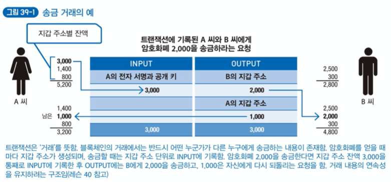
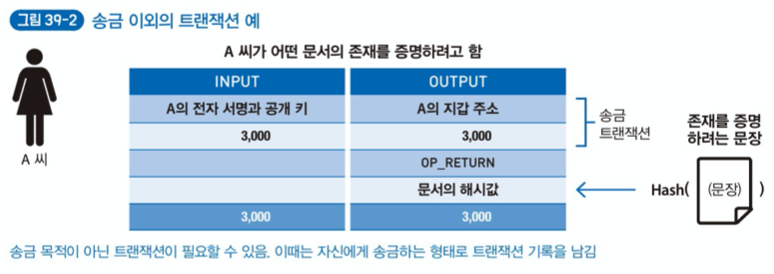

# Chapter 6. 블록체인에 거래를 기록하는 트랜잭션 이해하기

## Lesson 39. 트랜잭션의 역할과 내용

<u>블록체인의 기술적 관점</u>에서 `트랜잭션` 이라는 말이 나오면 보통 `거래` 를 의미한다. 예를 들어, '송금'하는 트랜잭션이라면 지갑 주소 하나에 있는 암호화폐를 다른 지갑 주소로 이동시킨다는 요청이 있으며, 해당 트랜잭션이 송신자의 것임을 증명하려고 만든 타임스탬프와 전자 서명이 포함되어 있다.

거래 내용, 타임스탬프, 전자 서명으로 이루어진 트랜잭션 파일의 해시값은 그 자체가 블록체인의 고유한 '트랜잭션 ID'이다.

거래 관련 트랜잭션은 보통 암호화폐를 보내는 사람과 받는 사람이 있다. 그런데 트랜젹션을 송금에만 사용하는 것은 아니다. 어떤 짧은 메시지를 기록하거나 문서의 존재를 증명하는 해시값을 기록할 때 '자신의 지갑에서 일부러 암호화폐를 꺼내 자신의 지갑에 거의 그대로 보낸다'는 특별한 트랜잭션을 만들 수도 있다. 이 기록 영역을 잘 이용하면 블록체인의 기능 자체를 확장할 수 있다.

>비트코인은 트랜잭션에 80바이트 정도의 짧은 메시지를 첨부할 수 있는 영역이 있다.
