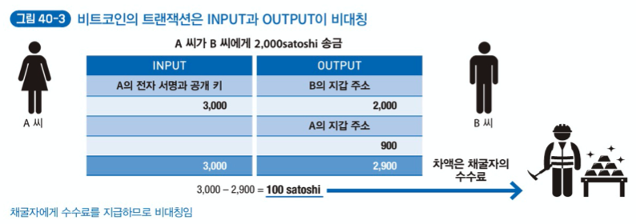
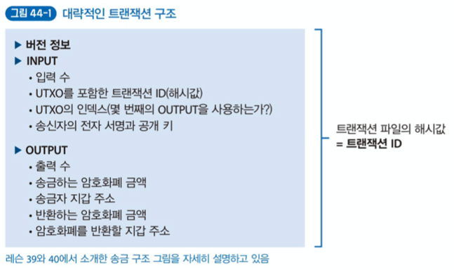
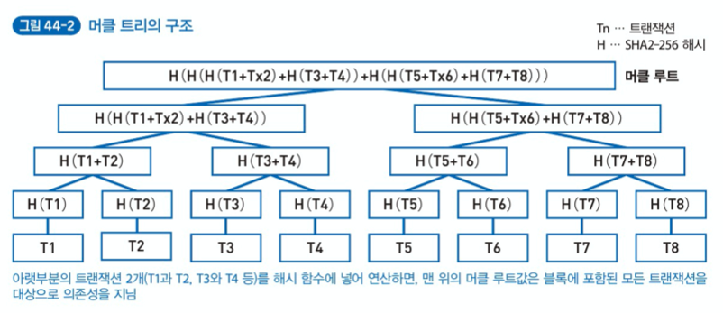
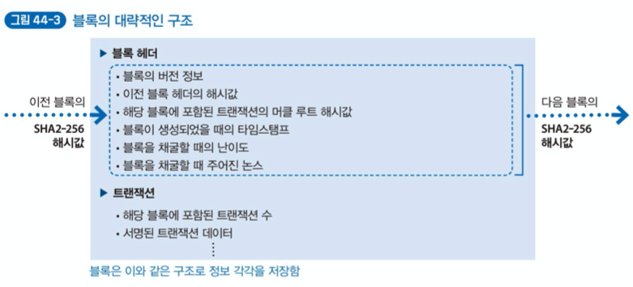
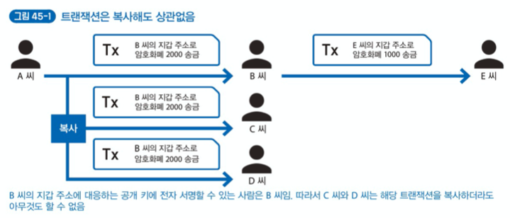
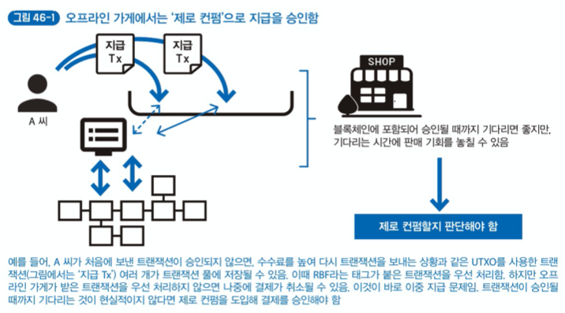

# Chapter 6. 블록체인에 거래를 기록하는 트랜잭션 이해하기

## Lesson 39. 트랜잭션의 역할과 내용

<u>블록체인의 기술적 관점</u>에서 `트랜잭션` 이라는 말이 나오면 보통 `거래` 를 의미한다. 예를 들어, '송금'하는 트랜잭션이라면 지갑 주소 하나에 있는 암호화폐를 다른 지갑 주소로 이동시킨다는 요청이 있으며, 해당 트랜잭션이 송신자의 것임을 증명하려고 만든 타임스탬프와 전자 서명이 포함되어 있다.

거래 내용, 타임스탬프, 전자 서명으로 이루어진 트랜잭션 파일의 해시값은 그 자체가 블록체인의 고유한 '트랜잭션 ID'이다.

거래 관련 트랜잭션은 보통 암호화폐를 보내는 사람과 받는 사람이 있다. 그런데 트랜젹션을 송금에만 사용하는 것은 아니다. 어떤 짧은 메시지를 기록하거나 문서의 존재를 증명하는 해시값을 기록할 때 '자신의 지갑에서 일부러 암호화폐를 꺼내 자신의 지갑에 거의 그대로 보낸다'는 특별한 트랜잭션을 만들 수도 있다. 이 기록 영역을 잘 이용하면 블록체인의 기능 자체를 확장할 수 있다.

>비트코인은 트랜잭션에 80바이트 정도의 짧은 메시지를 첨부할 수 있는 영역이 있다.

## Lesson 40.  지갑 주소의 미사용 잔액 'UTXO'

Lesson 35에서 보았던 것처럼 통상적인 지갑 앱은 많은 지갑 주소를 관리한다. 그리고 한 번 거래할 때마다 일회용이라는 느낌으로 주소를 생성한다. 그런데 지갑 앱은 많은 지갑 주소를 자동으로 관리하므로 사용자 대부분은 '어떤 지갑 주소에 암호화폐 잔액이 얼마 있다'는 자세한 정보를 알 필요가 없다.

지갑 앱이 나타내는 잔액은 지갑 앱이 괸리하는 많은 지갑 주소에 있는 미사용 잔액을 모두 합한 것이다. '자신이 사용할 수 있는 암호화폐의 한도'인 것이다. 그리고 이 미사용 잔액을 **UTXO(Unspent Transaction Output)**라고 한다.

블록체인은 `분산 원장 기술`의 구현이라고도 한다. UTXO가 원장에 해당하며 블록체인에 기록된 정보의 핵심 부분이기도 하다.

일정한 암호화폐 금액을 상대방에게 보낼 때는 자신이 소유한 UTXO 중 송금하는 데 충분한 잔액이 있는 UTXO를 INPUT에 배치한다. 그리고 상대의 지갑 주소로 송금하려는 암호화폐와 자신의 지갑 주소로 다시 되돌릴 잔액을 OUTPUT에 배치한다.

이때 거래 내용은 '송신자의 INPUT'과 '수신자의 OUTPUT' 합계가 항상 같아야한다. 이는 **복식부기 원장(=모든 거래 내용을 발생한 순서대로 기입하는 장부)을 기입(작성)하는 것과 같다.**

**트랜잭션은 반드시 UTXO, INPUT, OUTPUT의 균형을 항상 유지해야 한다**는 제약이 있다.

블록체인의 트랜잭션은 'UTXO >= INPUT = OUTPUT' 이라는 관계를 유지해야 한다고 했지만, 사실 비트코인의 트랜잭션 내용을 보면 'UTXO >= INPUT >= OUTPUT' 관계이다. **채굴자에게 수수료를 지급**할 암호화폐 금액을 빼기 때문이다. 수수료는 트랜잭션을 만드는 사람(송금자)이 자유롭게 정할 수 있다.

채굴자에게 지급하는 수수료(보상)를 자유롭게 설정할 수 있다면 수수료를 싸게 혹은 0으로 설정하는 것이 좋다고 생각할 수 있지만, 수수료가 너무 저렴하면 블록체인에 트랜잭션을 포함하지 못한다.

**'어떤 트랜잭션을 블록에 포함할 것인가?'는 채굴자가 자유롭게 정한다.** 즉, 채굴자에게 지급하는 수수료는 블록체인을 유지하는 데 필요한 보상이라는 면이 있다. 따라서 트랜잭션 풀에 트랜잭션이 많다면, 경제적 합리성을 고려해 수수료가 높은 것을 우선해서 블록에 포함한다. (수수료가 너무 싼 트랜잭션은 승인되지 않아 블록에 포함될 수 없다는 위험성이 있다.)

> 블록의 첫 기록(제네시스 블록)은 채굴자가 채굴에 성공했을 때 기록하는 'INPUT 없이 OUTPUT만 담긴 트랜잭션'이다.
>
> 비트코인의 제네시스 블록에는 OUTPUT에 50BTC가 담긴 트랜잭션 하나만 있다.

## Lesson 41. 트랜잭션을 합의하는 방법

트랜잭션은 P2P 분산 네트워크의 노드를 이용해 전 세계에 전달, 배포 및 복사된다. 먼저 사용자의 가장 가까운 노드에 트랜잭션을 배포한 후, 내용을 확인해 문제가 없으면 해당 트랜잭션을 복사한다. 이러한 **버킷 릴레이 방식으로 이웃 노드에 배포와 복사**를 반복해 전 세계에 전달한다. 일반적인 웹 서비스와 달리 특정 서버에 부하가 집중되지 않는다.

버킷 릴레이 방식으로 전 세계에 배포할 트랜잭션은 먼저 `트랜잭션 풀` 이나 `메모리 풀` 이라는 영역에 저장된다. 블록체인에 포함될 때까지 잠시 대기하는 상태이다.

트랜잭션이 트랜잭션 풀에 있으면 아직 블록체인이 트랜잭션을 포함한 것이 아니므로 해당 트랜잭션은 아직 '승인되지 않은 상태'이다. 블록체인에 트랜잭션이 포함되면 '승인된 상태'이자 해당 트랜잭션을 합의한 것이다.

생성한 트랜잭션을 트랜잭션 풀에 저장한 후 실제 **블록체인에 포함되기까지 적지 않은 시간 지연**이 있다.

## Lesson 42. 블록체인의 완결성 문제

블록체인이 '분기'한 상태에서는 합의가 종종 뒤집힐 수 있다. 블록체인의 분기는 거의 같은 시점에 채굴을 완료한 상황 등에 발생한다. 이때는 분기한 체인의 블록 높이로 어떤 체인을 선택할 때까지 잠시 기다려야 한다.

예를 들어, 분산 합의 알고리즘으로 작업 증명을 선택했고 분기한 체인 중 하나라도 높은 블록이 있으면 연산량까지 고려했을 때 더는 합의를 뒤집기 어렵다. 만전을 기했을 때 비트코인은 약 블록 6개(블록 1개 생성이 약 10분이므로 약 1시간) 정도 생성되면 합의가 뒤집힐 확률은 매우매우 낮다.

그러므로 블록체인은 완결성(나중에 결제 무효가 발생하지 않음)이 없으므로 무의미하다는 논란이 있다.

동시에 채굴을 완료해 블록체인이 분기한 상황에서 트랜잭션 내용을 보면, 기록된 순서는 달라도 분기한 두 블록에 같은 내용이 모두 포함된 상태일 때가 많다. 이때 트랜잭션 생성자 대부분은 **두 블록에 트랜잭션이 모두 포함된 상태이므로 분기 발생 상황을 가볍게 생각할 수 있다.**

그러나 블록의 채굴자 입장에서는 분기의 선택은 신규 발행되는 암호화폐가 자신의 것일지 다른 사람의 것일지 정해지는 순간이기도 하다.

블록체인의 분기는 주로 불특정 다수가 참여하는 퍼블릭 블록체인의 분산 합의 알고리즘에서 발생한다. 참여자의 수를 미리 아는 프라이빗 블록체인 또는 컨소시엄 형태의 환경에서 동작하는 분산 합의 알고리즘 기반의 블록체인은 보통 경제적 보상을 주지 않고 다수결로 합의할 때가 많다는 특징이 있다.

프라이빗 블록체인은 변조하기 어렵다는 블록체인의 특성은 그대로이고, 합의 형성은 퍼블릭 블록체인의 합의 형성과 비교했을 때 분기가 발생하지 않으므로 합의 지연 시간 문제가 거의 없다는 장점이 있다.

## Lesson 43. 트랜잭션의 순서를 보장하는 구조

블록체인에서는 트랜잭션을 전송한 순서대로 기록하지 않는다. 트랜잭션을 보내는 상대(노드)가 누구든 상관없다는 구조이다. 그런데 각 노드마다 성능 차이도 있고, 연결된 네트워크의 통신 속도도 다르기 때문에 상대적으로 거리가 먼 상황에서는 트랜잭션을 받는 시간 차이가 발생할 수밖에 없다.

비트코인은 채굴에 성공한 사람이 트랜잭션을 기록(블록을 생성)하는데, 어떤 사람이 채굴에 성공할지는 아무도 모른다. 즉 어떤 노드가 트랜잭션을 기록할지 알 수 없다는 것이다. 또한 어떤 노드가 채굴에 성공했을 때 어떤 트랜잭션을 기록할 것인지는 채굴자 마음이다.

기본적으로 블록체인은 트랜잭션에 대한 체인의 순서를 보장하지 않는다. 만약 꼭 순차적인 데이터 처리가 필요하다면 별도의 서브 시스템을 연결해 블록체인을 도입해도 괜찮다. 구체적으로 하이퍼레저 패브릭(Hyperledger Fabric)이라는 블록체인 시스템은 '카프카(Kafka)'와 함께 사용되어 트랜잭션의 처리 순서를 보장한다.

> 하이퍼레저 패브릭은 트랜잭션 풀에 모인 트랜잭션을 카프카의 파티션으로 정렬한다.

만약 순서는 보장해야 하지만 결과는 나중에 알려줘도 상관없는 업무라면, 약간의 지연 시간이 있더라도 트랜잭션의 타임스탬프 순서에 따라 처리 순서를 정할 수도 있다.

## Lesson 44. 블록체인 변경 불가성을 보장하는 구조

블록에 저장되는 트랜잭션의 내용이 어떤 구조인지 알아보자. 비트코인의 **트랜잭션은 UTXO, INPUT, OUTPUT으로 거래 내용을 기록한 데이터**이다.

비트코인의 각 트랜잭션은 수백 바이트 정도의 용량이다. 모든 트랜잭션은 블록 안에 포함되어 영구적으로 저장된다. 그러나 수억 개에 달하는 트랜잭션을 처음부터 검색하는 것은 작업 효율이 매우 나쁠 것이다. 따라서 빠른 검색과 접근을 위해 각 트랜잭션의 해시값과 해시값에서 만든 트랜잭션 ID를 인덱스로 삼아, **인덱스 하나에 문서 하나만 연결하는 키-값 스토리지(Key-Value Storage, KVS)에 저장한다.**

키-값 구조의 트랜잭션 ID 여러 개를 SHA2-256의 해시 함수로 여러 번 연산하는 상황을 생각해보자. 이 반복 연산을 그림으로 나타내면 트리 구조의 형태이다.

이진 트리(머클 트리)의 뿌리에 해당하는 부분을 '머클 루트'라고 한다. 머클 루트를 해시 함수에 넣어 얻은 값은 **트리에 포함된 모든 트랜잭션에 의존성이 있는 해시값으로 블록 헤더에 영구히 기록된다.**

이와 같은 트리 구조는 트랜잭션의 내용 조작을 어렵게 만들며, 모든 트랜잭션을 검색할 때 유용하다.

이번에는 블록에 포함된 정보를 알아보자. **블록은 크게 `블록 헤더`와 `트랜잭션`으로 나누어진다.**

블록체인에 저장되는 데이터는 해시값 형태이다. 따라서 데이터 변조가 발생하거나, **정상적인 트랜잭션의 저장 순서가 하나라도 잘못되면, 해당 블록 이후에 포함된 모든 해시값이 일치하지 않는다.**

따라서 **단방향 해시 체인의 무결성을 유지하면서 블록체인에 잘못된 처리가 있는 트랜잭션을 고의로 포함하는 작업은 천문학적으로 무수히 많은 연산을 시도해도 불가능하다.**

> 블록체인에 블록이 필요한 본질적인 이유는 한 방향을 참조하는 해시값의 체인 구조와 반복 참조하지 않는 해시체인 구조를 유지해 변경 불가성을 보장하려는 것이다.
>
> 블록체인은 분산 원장 기술을 구현하는 방법 중 하나일 뿐이다.

## Lesson 45. 복사해도 괜찮은 디지털 화폐 '암호화폐'

모든 정보를 0과 1만으로 나타내는 디지털 데이터는 물리적 손상이 없는 완전한 사본을 얼마든지 만들 수 있다. 그런데 금융 등의 분야에 IT를 이용할 때는 이러한 장점이 단점으로 변한다. 즉, 단순히 화폐를 디지털 데이터로 나타내면 화폐를 얼마든지 복사해 늘릴 수 있는 상태가 된다.

> 인터넷 발전 초기에 이미 암호 기술과 이메일을 이용해 화폐를 유통하는 아이디어를 생각해서 당시 여러 은행에서 연구와 실험을 거듭했지만, 결국 화폐 복사를 막는 방법은 고안되지 못해 실용화에 실패했다.

그러나 **블록체인은 처음부터 '복사 방지'라는 발상은 무시하고, 복사하더라도 암호 기술로 사용 권한을 제어한다는 방법을 선택해 문제를 해결했다.** -> 암호화폐라고 한 이유와 밀접한 연관이 있다.

블록체인은 노드끼리 트랜잭션을 복사해 버킷 릴레이 방식으로 전 세계에 배포한다. 이는 사람의 화폐 유통 방식과 비슷하다. 그래서 블록체인으로 화폐를 유통하겠다는 아이디어가 나온 것이다.

디지털 데이터인 트랜잭션은 아무리 복사하더라도 상관이 없다. 다음 트랜잭션을 만들기 위해서는 공개 키 암호의 공개 키(지갑 주소)에 대응하는 비밀 키(합법적인 전자 서명을 할 수 있는)가 있어야 하기 때문이다. 여기서 핵심은 송신자가 수신자를 정한다는 것이다.

## Lesson 46. 이중 송금 문제와 대책

블록체인은 합의 형성 상태가 되기까지 상당한 시간이 걸린다는 점이 시스템이 해결할 큰 과제이다. 그러나 블록체인에 기록된 데이터는 기록한 당사자조차 바꿀 수 없으므로 **변경 불가성이 필요한 정보를 저장할 때는 굉장히 유용하다. 즉, 권한만 있으면 언제든지 수정할 수 있는 일반적인 데이터베이스와 근본적으로 설계 사상이 다르다.**

오프라인 가게 결제 등에서 암호화폐로 결제할 때는 트랜잭션을 배포한 시점(트랜잭션 풀에 저장되었지만 아직 블록체인에 기록되지 않은 상황)에 지급을 승인하는 편이다. 이를 `제로 컨펌(Zero Confirmation)` 이라고 한다.

> 암호화폐 결제가 가능한 실제 오프라인 가게는 드물기 때문에 암호화폐 교환 업체의 결제 서비스를 이용해도 좋다. 교환 업체가 위험을 감수하고 즉시 결제를 승인한다.

## ETC

- https://steemit.com/kr/@hanmomhanda/blockchain
