# 07 스마트 계약의 계약 집행 구조 이해하기

스마트 계약은 **당사자가 없어도 계약의 합의 내용을 자동 실행하는 구조**이다. 이 기술 덕분에 2021년을 핫하게 달군 NFT, ICO(Initial Coin Offering), Decentralized Excanges 기술이 탄생했다.

## 47 스마트 계약

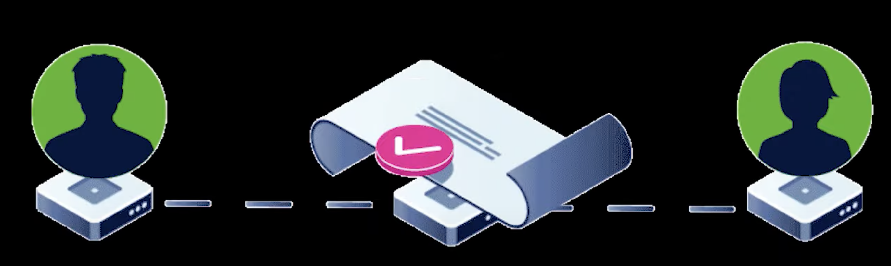

스마트 계약은 블록체인 네트워크를 실행하는 연산 기능이 있는 프로그램이다. 여러 사람이 합의한 계약을 당사자가 없어도 자동으로 실행하는 기능을 구현한 것이다.

### 유래

스마트 계약은 1997년 닉 제보가 제안한 개념이다. 자동으로 계약을 실행하는 프로그램을 뜻한다. 닉 제보는 스마트 계약의 정의를 설명하며 자동판매기를 예로 들었다.

### 계약의 개념

슈퍼에서 우리는 화폐로 사고 싶은 물건을 산다. 이를 계약이라고 의식하지 않겠지만 암묵적인 계약 행위이다. 즉 화폐를 지급하고 물건을 받는다는 것은 손님도 점원도 가치의 이전에 관한 합의, 계약이라는 것을 암묵적으로 동의한 것이다.

닉 제보는 이렇게 여러 사람이 합의한 계약을 사람이 없어도 자동으로 실행하는 방법을 스마트 계약으로 정의했다.

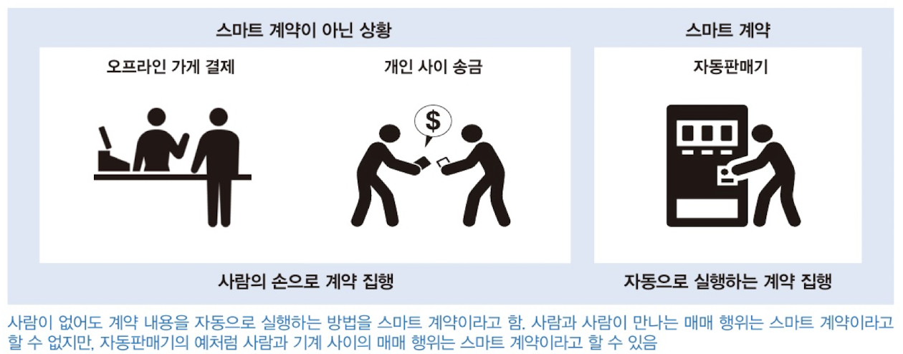

### 블록체인의 스마트 계약

블록체인에서는 계약 성립의 필요 조건이 기록된 거래 내용이 변조하기 어려운 상태로 블록체인에 기록되었으며, 거래 내용에 적힌 조건이 충족되면 자동으로 성립하는 트랜잭션을 스마트 계약이라고 정의한다.

즉 지갑 A에서 지갑 B로 암호화폐 사용 권리를 이전하는 단순 거래는 스마트 계약이 아니다. 하지만 일주일 하 제삼자의 이의 제기가 없을 때 지갑 A에서 B로 암호화폐 권리 이전하는 트랜잭션은 스마트 계약이다.

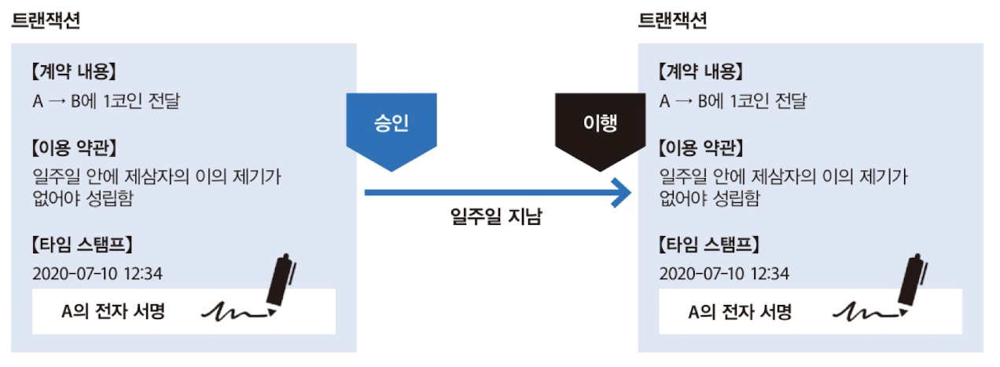

## 48 월드 스테이트

위에서 소개한 트랜잭션 기반보다 복잡한 조건 분기를 포함하는 스마트 계약을 소개한다.

### 스마트 계약의 구현 방법

위에서 소개한 트랜잭션 기반의 스마트 계약은 시간이 지나면 자동으로 조건이 성립했다. 그럼 좀 더 복잡한 조건 분기를 포함하는 스마트 계약은 어떻게 구현하면 좋을까? 기본적으로 스마트 계약은 프로그램의 하나 이므로 ㅇㅇ라는 조건을 만족할 때 ㅁㅁ를 실행한다는 조건을 구현하면 된다.

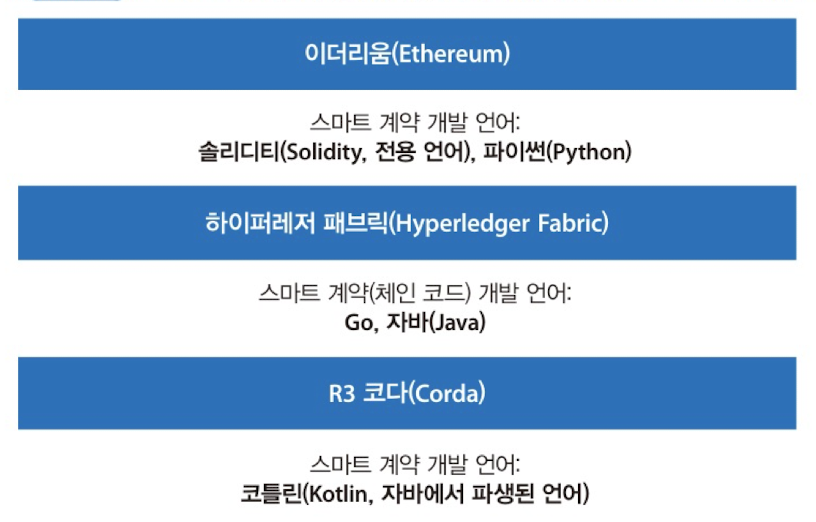

*스마트 계약을 만들 수 있는 블록체인과 기반 프로그래밍 언어*

### 월드 스테이트

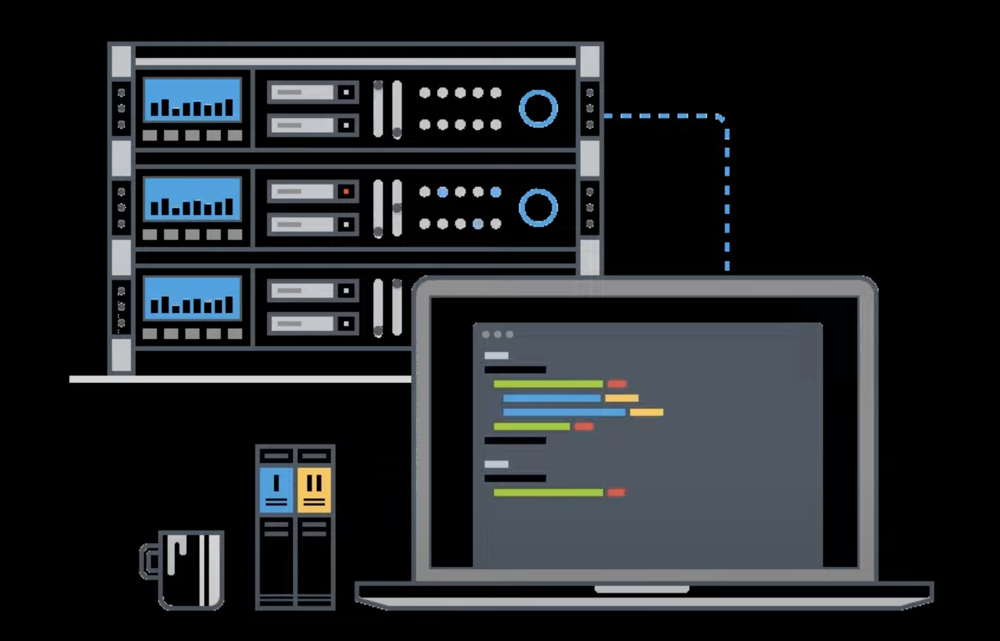

*개발자가 코딩을 해서 공유 네트워크에 올리는 스마트 계약*

위에서 소개된 프로그래밍 언어로 구현된 스마트 계약은 블록체인에 저장하면 바이트 코드라는 기계어로 변환된다. 그리고 바이트 코드의 해시값을 바탕으로 만든 주소를 연결해 어떤 인자를 넣어 실행하는 함수처럼 만든다.

사용자가 해당 함수를 이용할 때는 스마트 계약의 주소에 포함된 함수의 인자를 전달하는 트랜잭션을 만들고, 자신의 전자 서명을 첨부해 블록체인 네트워크에 배포한다. 해당 트랜잭션을 받은 노드는 설정한 인자를 바탕으로 가상 머신을 이용해 프로그램을 실행하고 노드 각각의 OUTPUT이 일치하면 블록체인에 기록한다. 이러한 합의 결과를 **월드 스테이트**라고 한다. **블록체인에서 참여자 전원이 참고**하는 공통의 합의이다.

> **가상 머신을 사용하는 이유**
>
> 네트워크에 연결된 모든 컴퓨터가 같은 스마트 계약 프로그램을 일제히 실행할 때, CPU 환경에 따라 바이트 코드 해석이 다를 수 있다. 이를 평준화하기 위해 동일한 환경을 구축할 수 있는 가상 머신을 사용한다.

### 월드 스테이트의 필요성

**스마트 계약은 네트워크 외부에 있는 정보를 자유롭게 불러올 수 없다.** 예를 들어, 회사의 주식 가격을 기록하려면 '주식 가격을 기록하는 스마트 계약'에 종목과 주식 가격 정보 트랜잭션은 담아 블록체인 네트워크에 배포한다. 모든 노드에서 이 트랜잭션을 블록체인에 기록하고자 합의하면, 해당 주가 정보는 월드스테이트 정보로 인정된다. 

스마트 계약은 모든 노드가 연산 결과에 서로 합의하는 구조이다. 그럼 만장일치로 합의한 정보를 이용해야 한다는 원칙을 모두가 수긍할 것이다. 만약  마음대로 **외부 데이터를 참조해 연산해도 좋다는 규칙이 있다면, 결과가 정말 옳은지 아무도 보장할 수 없으므로 합의할 수도 없다.** 따라서 스마트 계약은 파일 입출력, 외부 프로그램 실행, 외부 API 호출 등을 할 수 없다.

그런데 스마트 계약 역시 프로그램이므로 내부 정보만이 아니라 외부 정보까지 참조해 연산 결과를 도출해 내야한다. 이때 필요한 블록체인의 저장 공간이 월드 스테이트이다.

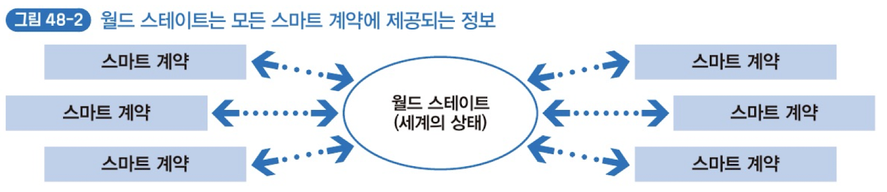

### 월드 스테이트의 이해

블록체인에서 동작하는 모든 스마트 계약이 참조하는 전역변수라고 생각하자.

### 월드 스테이트의 합의는 탈중앙화 조직이 필요하지 않음

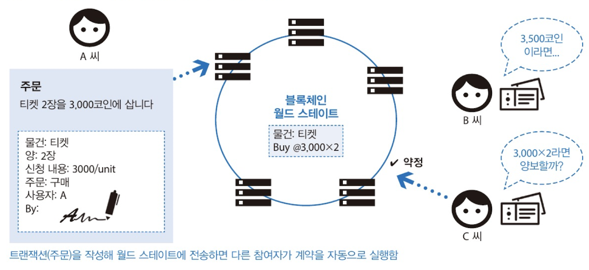

스마트 계약과 월드 스테이트를 활용해 티켓을 사고파는 게시판을 구현했다고 생각하자. 이 게시판은 판매자, 구매자, 원하는 티켓 종류, 티켓 금액 등의 정보를 월드 스테이트에 저장한다. 그럼 블록체인 네트워크에 참여한 사람 모두가 월드 스테이트를 참조해 해당 정보를 확인할 수 있다. **월드 스테이트를 참조한 다른 참여자가 자신이 거래할 상대방을 찾으면 계약을 자동으로 실행**한다.

이러한 티켓 거래소의 핵심은 **네트워크 참여자가 특정 회사와 관계없이 게시판의 거래에 참여할 수 있다**는 것이다. 즉 관리자가 없이 자율 운영된다는 뜻이다. 이러한 자율 분산 서비스 기반의 조직 운영을 탈중앙화된 자율 조직(Decentralized Autonomous Organization, DAO) 또는 탈중앙화된 자율 회사(Decentralized Autonomous Company, DAC)라고 한다.

## 49 관리자 없는 조직

### 조직 운영을 스마트 계약에 맡김

스마트 계약을 사용하는 회사를 소개할 때 DAO 또는 DAC를 언급한다. DAO, DAC는 인간이 개입할 수 없는 컴퓨터 프로그램을 운영 기반으로 삼는 조직이나 회사를 뜻한다. 조직의 규칙이나 계약을 조건 분기의 모음으로 만든 후, 스마트 계약으로 블록체인에 기록하고 규칙이나 계약이 자동으로 실행하도록 만든다.

### 코드가 법

전 세계에 흩어져 움직이는 이더리움 기반 스마트 계약은 어떤 국가에 속하거나 관리를 받지 않으므로, 스마트 계약을 운영 기반으로 삼을 때는 코드로 작성해 실행하는 것만 법으로 인정해야 한다고 주장한다.

> **사람의 실수가 있을 수 있는 코드**
>
> 코드에는 사람의 실수가 있을 수 있다고 생각하는 쪽에서는 프로그램에 문제가 생기면 참고할 수 있는 자연어로 작성된 계약서를 함께 저장해서 참고한다.

### 비용 문제

모든것을 디지털화 해서 스마트 계약으로 계약을 이행하면 중개업자가 필요 없어져 경제적 비용을 낮춘 사회가 형성될 가능성이 있다. 하지만 우리 생활 대부분 실물 재화가 필요한데 이는 결코 디지털화할 수 없다. 

보통 재화 소유자와 보관 장소를 기반으로 실제 재화 소유자와 보관 장소를 확인 할 수 있어야한다. 이렇게 사실이 일치할 때는 DAC, DAO를 이용해 유통 비용을 절감할 수 있따. 하지만 실제 유통 시스템은 재화 소유자와 보관 장소 정보를 사실과 꼭 일치시킬 필요가 없다. 실제론 소유자와 보관 장소가 자주 바뀌면 많은 이동 비용을 소모하기 때문에, 대량으로 재화를 보관후 실제 이동이 필요할 때만 보관 장소 정보를 바꿈으로 유통 비용을 절감한다.

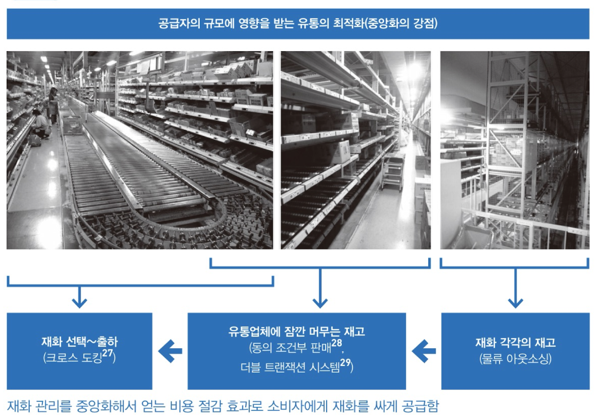

## 50 외부 데이터 참조와 오라클

### 블록체인은 외부 정보를 직접 사용할 수 없다

스마트 계약안에서 조금 복잡한 조건을 처리할 때 외부 정보를 이용하고픈 상황이 종종 있다. 열기구 탑승권에 비나 눈이 오지 않고 풍속이 5m/s 미만일 때만 탑승 가능한 조건을 설정하고 싶다면 실시간 기상  데이터를 외부에서 불러와서 쓰면 될 것이다.

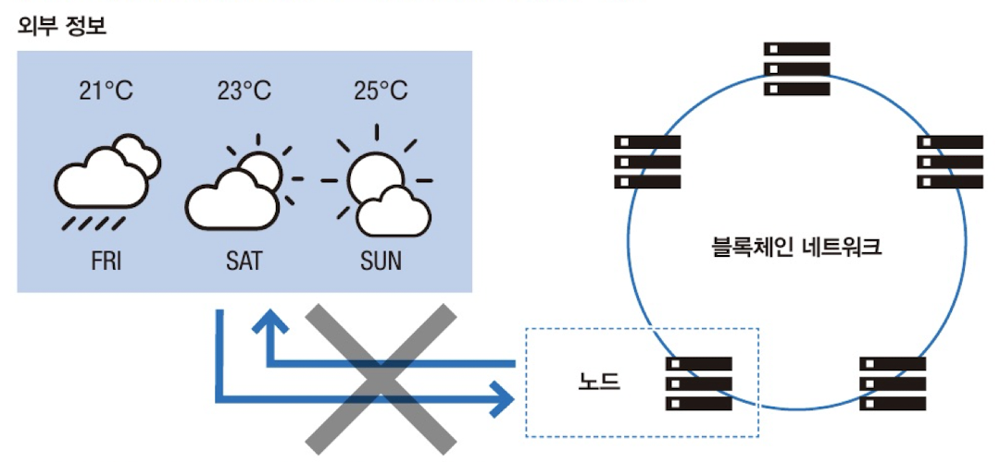

하지만 스마트 계약은 의사 결정에 사용하는 정보가 모든 네트워크 참여자의 동의를 얻은 것이어야 한다는 제약이 있다.

### 공공 기관 정보는 가능할까?

기상청과 같은 공공 기관은 국가가 발표하는 자료에 신뢰성을 보장한다. 하지만 분산 합의가 기본인 블록체인 시스템은 공공 기관의 정보도 합의하지 않은 외부 정보로 취급한다. 

### 신뢰할 수 있는 정보, 오라클

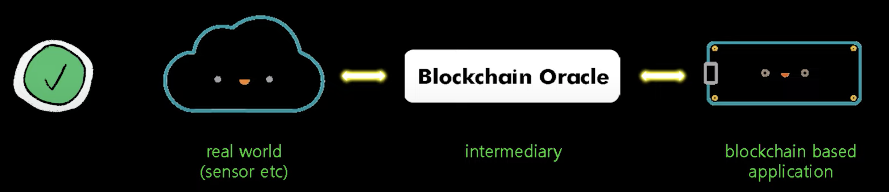

스마트 계약을 실행할 때 외부 정보는 모두 신뢰하지 않으면 아무것도 할 수 없을 것이다. 그래서 나온 개념이 오라클이라는 개념이다. 신의 계시라는 뜻으로 외부에서 블록체인에 불러온 정보 자체를 월드 스테이트로 여기겠다는 뜻이다. 

그러나 외부 데이터에 잘못된 정보가 섞여 있을 가능성이 있다는 사실을 꼭 기억해야 한다. 즉, 오라클을 제공하는 개인 또는 조직은 완전히 신뢰할 수 있는 곳으로 엄선해야한다.

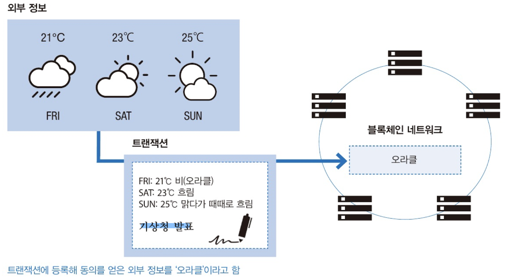

### 오라클 결정권자

신의 계시라는 오라클은 블록체인 참여자가 결정한다. 이를 모순으로 느낄 수 있다. 그런데 스마트 계약은 오라클을 블록체인 참여자의 합의로 선택한다. 이러한 예 중 하나로 예측 시장이 있다. 미래에 일어날 만한 일을 몇 개 생각한 후 그중 어떤 것이 일어날지 예측한다. 그리고 예측 결과가 어땟는지 검증된 것만 오라클로 삼는다.

### 예측 시장을 이용한 오라클 사용의 단점

예측 시장은 예측 결과를 선택하는 기간과 예측 결과를 검증하는 기간이 있다. 나쁜 참여자만 모이면 잘못된 예측 결과를 선택할 수 있으므로, 예측 시장에서는 평판이라는 지표와 함께 예측 결과가 올바른지 검증해 참여자에게 보상을 준다.

하지만 오라클이 확정되기까지 시간이 필요하므로 실시간 처리가 어렵다는 단점도 있다.

## 51 스마트 계약의 미래

### 시스템이 자율적으로 서비스를 제공하는 세계

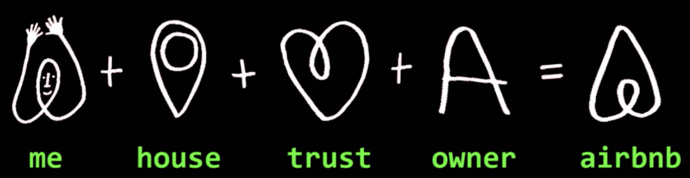

스마트 계약이 인간 대 인간의 기술이 아닌 IOT나 기계와 연결이 될 수도 있다. 우리가 에어비앤비 예약할 때는 위의 그림 같이 에어비앤비라는 회사가 집과 주인과의 신뢰를 보증해줌으로서 이루어진다.

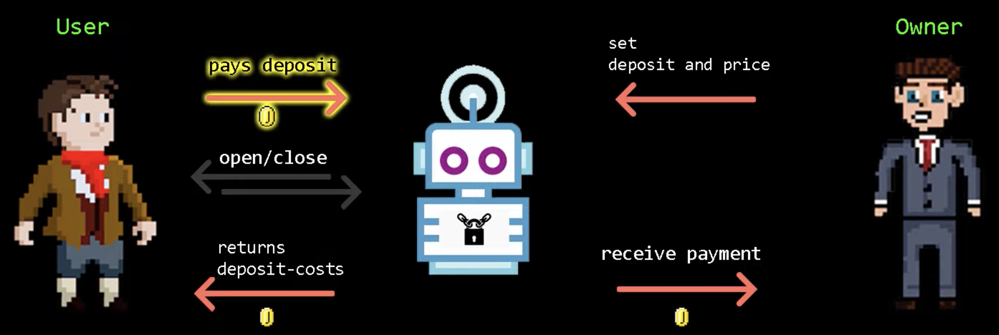

하지만 스마트 계약이 사이에 끼면 유저가 조건에 맞춰 돈을 지불하면 IOT에 연결된 스마트 계약이 하루동안 문을 열어주고, 전기를 공급해줄 수도 있는 것이다. 

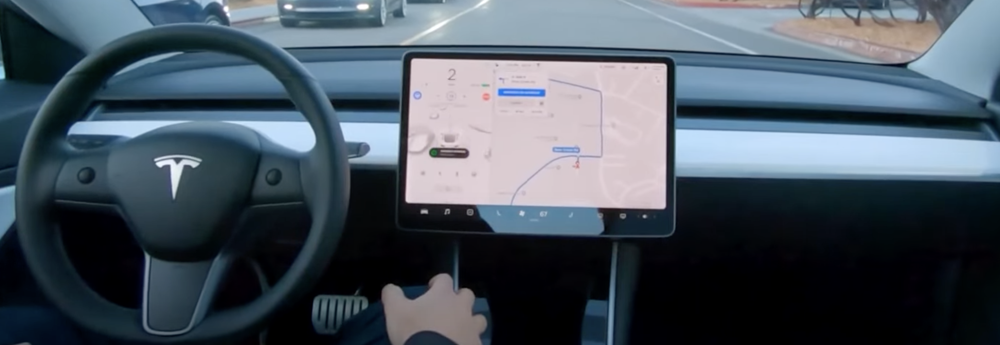

이러한 스마트 계약은 테슬라를 특정 금액 조건에 맞춰 지불한 고객을 특정 위치에 데려다 주는 용도로도 사용할 수도 있다.

### 시스템이 수집한 정보를 다른 스마트 계약이 이용

월드 스테이트에 기록한 정보는 해당 정보를 기록한 스마트 계약뿐 아니라 다른 스마트 계약에서도 참조할 수 있다. 여러 사물 인터넷 기기의 센서가 수집하는 데이터는 월드 스테이트에 쌓일 것이고 전혀 다른 스마트 계약이 해당 데이터를 사용하면서 점점 발전할 것이다.

