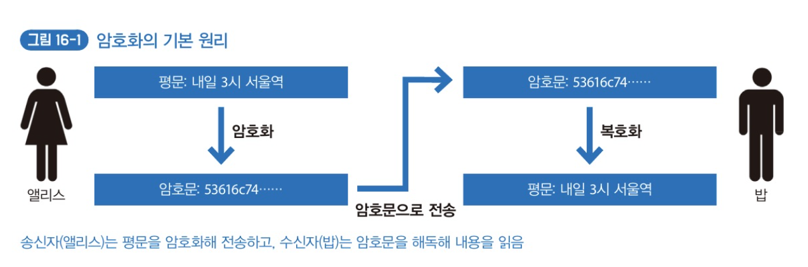
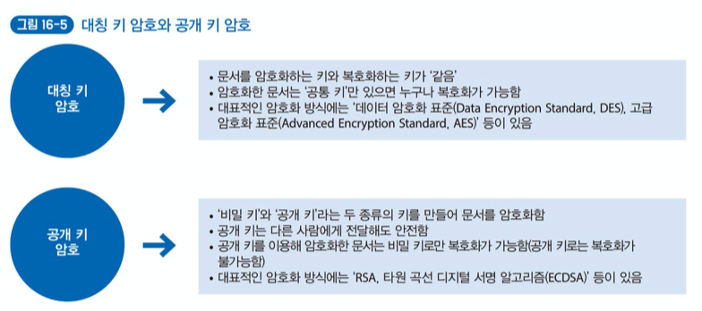
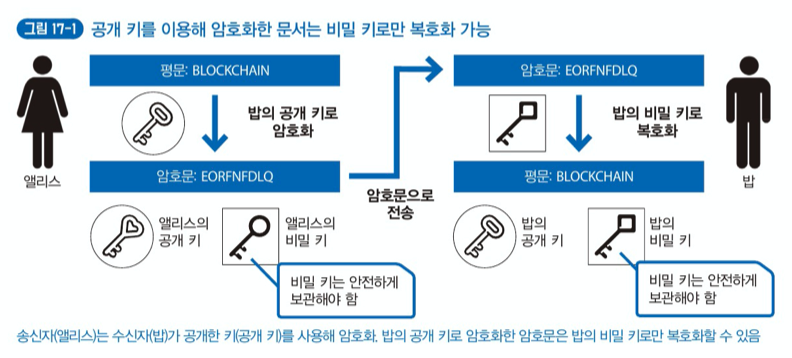
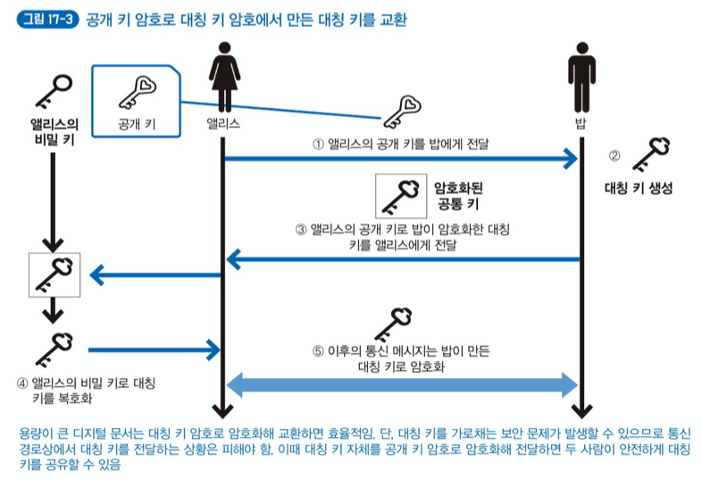
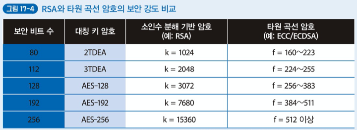

# Chapter 3. 블록체인을 지원하는 암호화 기술 이해하기

## Lesson 16. 정보 시스템을 지원하는 현대 암호화 기술

- 평문: 사람이 이해하는 문장.
- 암호문(암호): 암호화한 문장.
- 암호화(Encryption): 사람이 이해하는 문장을 어떤 규칙에 따라 이해하지 못하는 형태로 변환해 비밀을 교환하는 것.
- 복호화(Decryption): 암호문을 평문으로 되돌리는 것.

컴퓨터가 발전하며 현대의 암호화 기술은 과거와 비교해 비밀을 교환하기 위한 도구에서 벗어나 **일상 생활의 안전을 지키는 파수꾼**으로 변하였다. 문서의 비밀 보호만을 목표로하지 않고 다양한 특징을 갖게 되었다.

- 문서 접근 권한을 특정 사람에게만 한정함.
- 문서 내용이 변경되지 않았음을 보장함.
- **문서 작성자의 서명을 검증하거나 증명함.**
- 문서가 어느 시점에 만들어졌는지 증명함.
- 문서에 포함된 내용을 부인하지 못하도록 함.

블록체인은 암호화 기술의 특성을 적절히 이용해 당사자 두 사람 사이뿐만 아니라 **네트워크에 참여하는 모든 사람이 암호화 기술의 장점을 누릴 수 있는 구조**로 되어 있다. 그러므로 블록체인을 제대로 이해하려면 암호화 기술을 이해하는 것이 중요하다.

암호화의 요소에는 `암호 만들기(암호화)`, `암호 풀기(복호화)`, `암호 만들기와 풀기에 사용하는 키` 가 있다. 오래존부터 존재하는 많은 암호화 방식이 있는데, 공통적인 특징은 암호화와 복호화 방법, 암호를 푸는 키를 외부에 알리지 않아야 한다는 점이다.

그러나, **수학 이론을 기반으로하는 컴퓨터가 발전한 이후의 현대 암호화 기술에서는 암호화, 복호화, 키를 만드는 방법 자체는 더 이상 비밀이 아니다. 비밀로 해야하는 부분은 공개된 방법대로 만든 개별 키 자체이다.**

현대 암호화 기술은 `대칭 키 암호(Symmetric Key Cryptography)`와 `공개 키 암호(Public Key Cryptography)` 방식을 사용한다.

**블록체인에서는 공개 키 암호 방식을 많이 사용하며, 특히 다른 공개 키 암호방식보다 키 길이가 짧은 `타원 곡선 암호(Elliptic Curve Cryptography)`를 자주 사용한다.**

## Lesson 17. 특정 사람만이 정보에 접근하는 공개 키 암호

블록체인처럼 여러 참여자가 있는 네트워크에서 특정 사람에게만 문서 접근과 제어 권한을 부여할 때는 '공개 키 암호'가 유용하다. 공개 키로 암호화한 문서는 비밀 키로만 복호화 할 수 있기 때문이다. 즉, **특정 사람만 어떤 작업이 가능한 구조를 만드는 데 적합하다.**

이렇게 공개 키 암호를 사용하면 암호를 푸는 키(비밀 키)를 바꿀 필요가 없다. **그렇지만 공개 키 암호화 방식의 경우 대칭 키 암호 방식과 비교했을 때 계산 시간이 훨씬 오래 걸리기(= 복호화에 오래 걸린다.) 때문에, 용량이 큰 데이터를 암호화할 때 적합하지 않다.**

> HTTPS(SSL/TSL) 등의 경우도 보통 대칭 키 자체를 서로 주고받을 때 공개 키 암호 방식을 사용한다.

블록체인에서는 'RSA' 공개 키 암호화 방식보다 타원 곡선 암호 기반의 타원 곡선 디지털 서명 알고리즘(Elliptic Curve Digital Signature Algorithm, ECDSA)이라는 공개 키 암호를 많이 사용한다.

타원 곡선 디지털 서명 알고리즘의 경우는 RSA와 비교했을 때 상당히 짧은 키만 사용해도 같은 정도의 보안 강도를 유지할 수 있다. 그러므로 발행된 모든 트랜잭션에 전자 서명을 해야하는 블록체인 네트워크에서는 처리 속도가 상대적으로 빠른 타원 곡선 암호가 RSA보다 블록체인에 더 적합하다.

